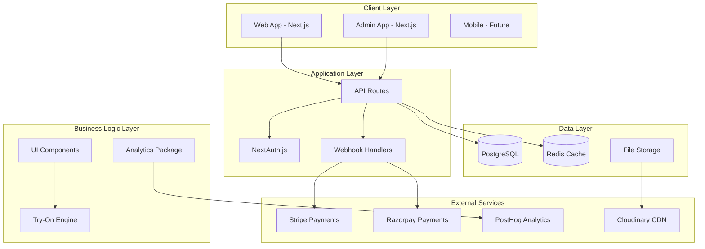
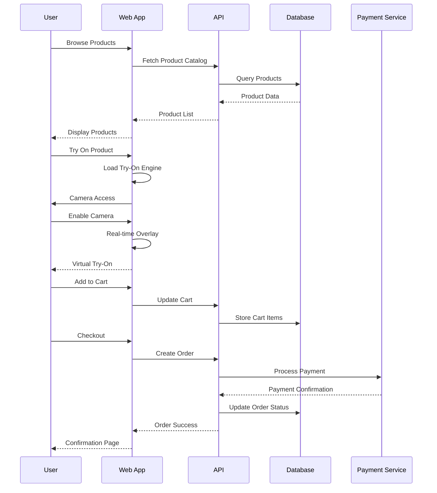
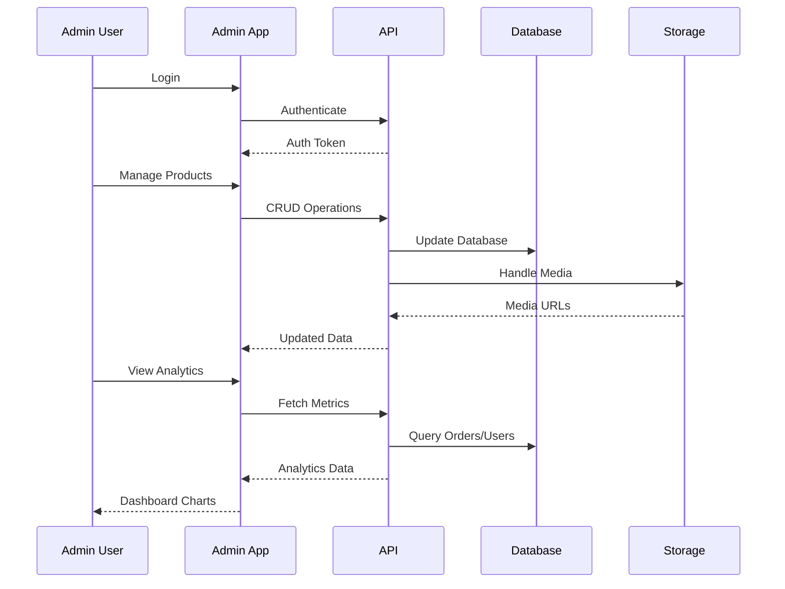
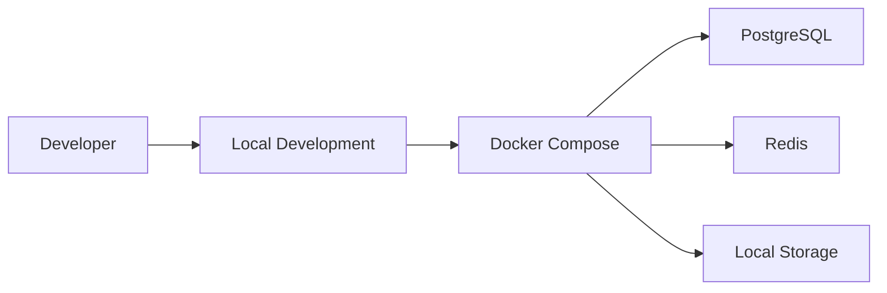
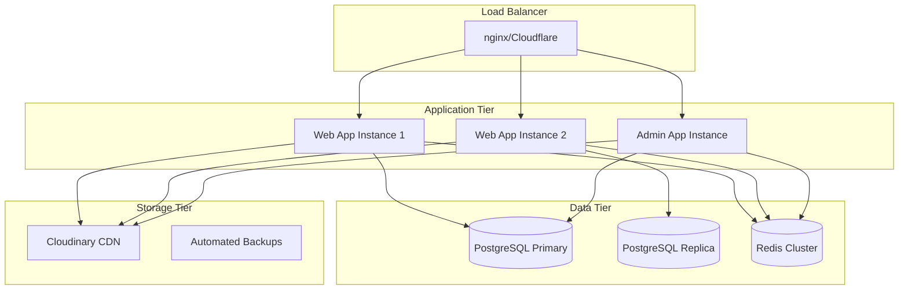
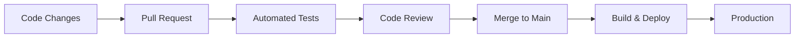

# Architecture Overview

## System Architecture

The RadhaGsareees platform is built as a modern monorepo with multiple applications and shared packages, designed for scalability and maintainability.



## Monorepo Structure

```
radhagsareees/
├── apps/
│   ├── web/          # Customer-facing e-commerce app
│   └── admin/        # Admin dashboard
├── packages/
│   ├── ui/           # Shared UI components
│   ├── analytics/    # Analytics abstraction layer
│   ├── db/          # Database schema & client
│   └── config/      # Shared configurations
├── docs/            # Documentation
├── e2e/            # End-to-end tests
└── scripts/        # Build & deployment scripts
```

## Technology Stack

### Frontend
- **Framework**: Next.js 14 with App Router
- **Styling**: TailwindCSS with custom design system
- **UI Components**: Custom accessible components
- **State Management**: React hooks + Context API
- **Internationalization**: next-intl
- **Try-On**: Canvas-based client-side overlay

### Backend
- **Runtime**: Node.js
- **Database**: PostgreSQL with Prisma ORM
- **Caching**: Redis for session & rate limiting
- **Authentication**: NextAuth.js with multiple providers
- **Payments**: Stripe & Razorpay integration
- **File Storage**: Cloudinary for images/videos

### DevOps & Tools
- **Package Manager**: pnpm with workspaces
- **Build System**: Turbo for monorepo builds
- **Testing**: Jest + Testing Library + Playwright
- **Linting**: ESLint with custom rules
- **Type Safety**: TypeScript throughout
- **CI/CD**: GitHub Actions (future)

## Application Flow

### Web Application (Customer)


### Admin Application


## Scalability Considerations

### Horizontal Scaling
- **Stateless Applications**: All apps are stateless and can be replicated
- **Database Sharding**: Prepared for horizontal database scaling
- **CDN Integration**: Static assets served via Cloudinary CDN
- **Microservices Ready**: Packages designed for future service extraction

### Performance Optimizations
- **Code Splitting**: Next.js automatic code splitting
- **Image Optimization**: Next.js Image component + Cloudinary
- **Caching Strategy**: Multi-level caching (Redis, CDN, Browser)
- **Bundle Analysis**: Webpack bundle analyzer integration

### Monitoring & Observability
- **Error Tracking**: Structured error handling
- **Performance Monitoring**: Web Vitals tracking
- **Analytics**: PostHog integration for user behavior
- **Health Checks**: API endpoint monitoring

## Security Architecture

### Authentication & Authorization
- **Multi-Provider Auth**: NextAuth.js with Google, GitHub
- **Session Management**: JWT tokens with secure storage
- **Role-Based Access**: Admin vs Customer permissions
- **API Security**: Route protection and validation

### Data Protection
- **Input Validation**: Zod schemas throughout
- **SQL Injection Prevention**: Prisma ORM parameterized queries
- **XSS Protection**: Content Security Policy headers
- **CSRF Protection**: Built-in Next.js CSRF tokens

### Infrastructure Security
- **HTTPS Only**: Forced SSL in production
- **Environment Variables**: Secure secret management
- **Rate Limiting**: API endpoint protection
- **Webhook Validation**: Stripe/Razorpay signature verification

## Deployment Strategy

### Development Environment


### Production Environment (Future)


## Future Enhancements

### Short Term (3-6 months)
- **Mobile App**: React Native application
- **Advanced Try-On**: Server-side AI synthesis
- **Inventory Management**: Real-time stock tracking
- **Advanced Analytics**: Custom dashboard metrics

### Long Term (6-12 months)
- **Multi-tenant**: Support multiple brands
- **Marketplace**: Third-party seller integration
- **AI Recommendations**: ML-powered product suggestions
- **Global Expansion**: Multi-currency and localization

## Development Workflow

### Code Organization
- **Shared First**: Common functionality in packages
- **Type Safety**: Strict TypeScript configuration
- **Component Library**: Reusable UI components
- **Testing Strategy**: Unit, integration, and E2E tests

### Quality Assurance
- **Automated Testing**: Jest + Playwright test suites
- **Code Review**: PR-based development workflow
- **Performance Budgets**: Bundle size monitoring
- **Accessibility**: WCAG 2.1 AA compliance

### Deployment Pipeline
