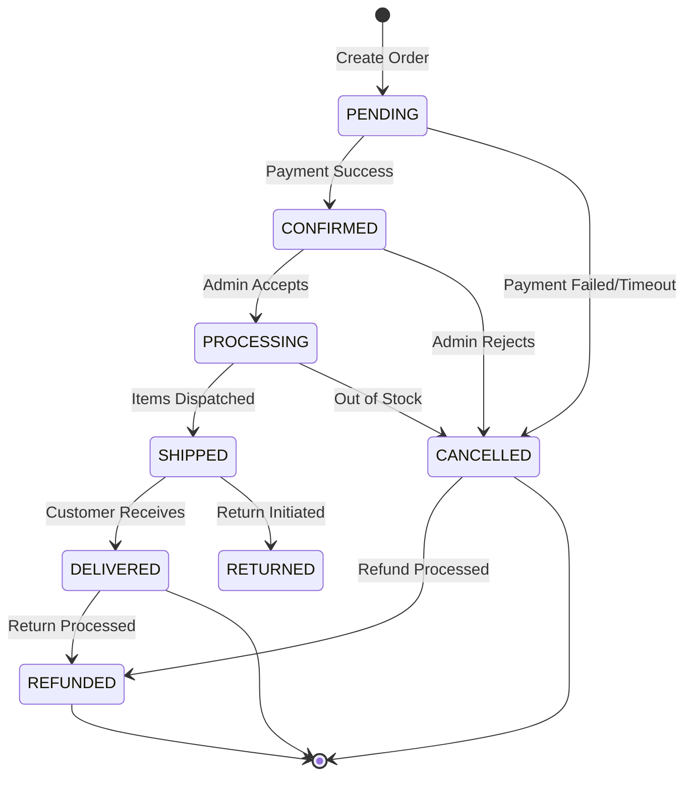

# Data Model & Database Schema

## Entity Relationship Diagram

```mermaid
erDiagram
    User {
        string id PK
        string name
        string email UK
        string image
        datetime emailVerified
        datetime createdAt
        datetime updatedAt
        enum role "CUSTOMER, ADMIN"
    }

    Account {
        string id PK
        string userId FK
        string type
        string provider
        string providerAccountId
        string refresh_token
        string access_token
        int expires_at
        string token_type
        string scope
        string id_token
        string session_state
    }

    Session {
        string id PK
        string sessionToken UK
        string userId FK
        datetime expires
    }

    VerificationToken {
        string identifier
        string token UK
        datetime expires
    }

    Category {
        string id PK
        string name UK
        string description
        string slug UK
        string imageUrl
        boolean active
        datetime createdAt
        datetime updatedAt
    }

    Product {
        string id PK
        string name
        string description
        decimal basePrice
        decimal salePrice
        string sku UK
        string categoryId FK
        json images
        json specifications
        json tryOnConfig
        enum status "DRAFT, ACTIVE, INACTIVE, DISCONTINUED"
        int stockQuantity
        int lowStockThreshold
        boolean trackInventory
        datetime createdAt
        datetime updatedAt
    }

    ProductVariant {
        string id PK
        string productId FK
        string name
        string sku UK
        decimal priceAdjustment
        json attributes
        int stockQuantity
        boolean active
        datetime createdAt
        datetime updatedAt
    }

    Order {
        string id PK
        string userId FK
        string orderNumber UK
        decimal subtotal
        decimal tax
        decimal shipping
        decimal total
        enum status "PENDING, CONFIRMED, PROCESSING, SHIPPED, DELIVERED, CANCELLED, REFUNDED"
        json shippingAddress
        json billingAddress
        string paymentIntentId
        string trackingNumber
        datetime orderDate
        datetime shippedAt
        datetime deliveredAt
        datetime createdAt
        datetime updatedAt
    }

    OrderItem {
        string id PK
        string orderId FK
        string productId FK
        string variantId FK
        int quantity
        decimal unitPrice
        decimal totalPrice
        json productSnapshot
        datetime createdAt
        datetime updatedAt
    }

    Cart {
        string id PK
        string userId FK
        datetime createdAt
        datetime updatedAt
    }

    CartItem {
        string id PK
        string cartId FK
        string productId FK
        string variantId FK
        int quantity
        datetime createdAt
        datetime updatedAt
    }

    Review {
        string id PK
        string userId FK
        string productId FK
        string orderId FK
        int rating
        string title
        string comment
        json images
        boolean verified
        boolean featured
        datetime createdAt
        datetime updatedAt
    }

    Wishlist {
        string id PK
        string userId FK
        string productId FK
        datetime createdAt
    }

    TryOnSession {
        string id PK
        string userId FK
        string productId FK
        string variantId FK
        json sessionData
        json tryOnResults
        enum status "ACTIVE, COMPLETED, EXPIRED"
        datetime startedAt
        datetime completedAt
        datetime expiresAt
        datetime createdAt
    }

    InventoryTransaction {
        string id PK
        string productId FK
        string variantId FK
        enum type "IN, OUT, ADJUSTMENT, RESERVED, RELEASED"
        int quantity
        int previousStock
        int newStock
        string reason
        string orderId FK
        json metadata
        datetime createdAt
    }

    PaymentMethod {
        string id PK
        string userId FK
        string provider "STRIPE, RAZORPAY"
        string externalId
        string type "CARD, UPI, NETBANKING, WALLET"
        json details
        boolean isDefault
        datetime createdAt
        datetime updatedAt
    }

    WebhookEvent {
        string id PK
        string provider "STRIPE, RAZORPAY"
        string eventType
        string externalId UK
        json payload
        enum status "PENDING, PROCESSING, PROCESSED, FAILED"
        int attemptCount
        string errorMessage
        datetime processedAt
        datetime createdAt
        datetime updatedAt
    }

    AnalyticsEvent {
        string id PK
        string userId FK
        string sessionId
        string eventType
        string eventName
        json properties
        json context
        datetime timestamp
        datetime createdAt
    }

    %% Relationships
    User ||--o{ Account : has
    User ||--o{ Session : has
    User ||--o{ Order : places
    User ||--|| Cart : has
    User ||--o{ Review : writes
    User ||--o{ Wishlist : maintains
    User ||--o{ TryOnSession : creates
    User ||--o{ PaymentMethod : has
    User ||--o{ AnalyticsEvent : generates

    Category ||--o{ Product : contains
    
    Product ||--o{ ProductVariant : has
    Product ||--o{ OrderItem : "ordered as"
    Product ||--o{ CartItem : "added to cart"
    Product ||--o{ Review : "reviewed as"
    Product ||--o{ Wishlist : "wishlisted as"
    Product ||--o{ TryOnSession : "tried on"
    Product ||--o{ InventoryTransaction : affects

    ProductVariant ||--o{ OrderItem : "ordered as"
    ProductVariant ||--o{ CartItem : "added to cart"
    ProductVariant ||--o{ TryOnSession : "tried on"
    ProductVariant ||--o{ InventoryTransaction : affects

    Order ||--o{ OrderItem : contains
    Order ||--o{ Review : "can be reviewed"
    Order ||--o{ InventoryTransaction : triggers

    Cart ||--o{ CartItem : contains

    Order ||--o{ WebhookEvent : "triggers via payment"
```



## Core Entities

### User Management

#### User Entity
- **Authentication**: Integrated with NextAuth.js
- **Roles**: Customer (default) and Admin roles
- **Profile**: Name, email, profile image
- **Audit**: Creation and update timestamps

#### Account & Session
- **Multi-Provider**: Supports Google, GitHub, email providers
- **Session Management**: Secure JWT-based sessions
- **Token Handling**: Refresh and access token storage

### Product Catalog

#### Category Hierarchy
```sql
-- Categories support hierarchical structure
CREATE TABLE categories (
    id UUID PRIMARY KEY DEFAULT gen_random_uuid(),
    name VARCHAR(255) NOT NULL UNIQUE,
    description TEXT,
    slug VARCHAR(255) NOT NULL UNIQUE,
    parent_id UUID REFERENCES categories(id),
    image_url TEXT,
    active BOOLEAN DEFAULT true,
    sort_order INTEGER DEFAULT 0,
    created_at TIMESTAMP DEFAULT NOW(),
    updated_at TIMESTAMP DEFAULT NOW()
);
```

#### Product Configuration
```typescript
// Product Try-On Configuration
interface TryOnConfig {
  enabled: boolean;
  category: 'saree' | 'lehenga' | 'kurti' | 'jewelry';
  overlayPoints: {
    shoulder: { x: number; y: number };
    waist: { x: number; y: number };
    length: { x: number; y: number };
  };
  adjustmentSettings: {
    brightness: number;
    contrast: number;
    opacity: number;
  };
  fallbackImage?: string;
}

// Product Specifications
interface ProductSpec {
  material: string;
  care: string[];
  measurements: {
    [size: string]: {
      length: number;
      width: number;
      bust?: number;
      waist?: number;
    };
  };
  colors: string[];
  occasions: string[];
}
```

#### Inventory Management
```typescript
// Inventory Transaction Types
enum TransactionType {
  IN = 'IN',              // Stock received
  OUT = 'OUT',            // Stock sold/shipped
  ADJUSTMENT = 'ADJUSTMENT', // Manual correction
  RESERVED = 'RESERVED',   // Reserved for order
  RELEASED = 'RELEASED'    // Released from reservation
}

// Stock Level Calculation
interface StockLevel {
  physical: number;      // Physical stock count
  reserved: number;      // Reserved for pending orders
  available: number;     // Available for sale (physical - reserved)
  incoming: number;      // Stock on order from suppliers
}
```

### Order Management

#### Order Lifecycle


#### Order Item Structure
```typescript
// Order Item with Product Snapshot
interface OrderItem {
  id: string;
  orderId: string;
  productId: string;
  variantId?: string;
  quantity: number;
  unitPrice: number;
  totalPrice: number;
  
  // Product snapshot at time of order
  productSnapshot: {
    name: string;
    description: string;
    images: string[];
    specifications: ProductSpec;
    category: string;
  };
}
```

### Analytics & Tracking

#### Event Tracking Schema
```typescript
// Analytics Event Structure
interface AnalyticsEvent {
  userId?: string;
  sessionId: string;
  eventType: 'page_view' | 'product_view' | 'add_to_cart' | 'purchase' | 'try_on';
  eventName: string;
  
  properties: {
    // Event-specific properties
    product_id?: string;
    category?: string;
    value?: number;
    currency?: string;
    [key: string]: any;
  };
  
  context: {
    page: string;
    referrer?: string;
    user_agent: string;
    ip_address: string;
    timestamp: Date;
  };
}
```

#### Try-On Session Tracking
```typescript
// Try-On Session Data
interface TryOnSession {
  id: string;
  userId?: string;
  productId: string;
  variantId?: string;
  
  sessionData: {
    device: 'mobile' | 'desktop';
    camera: 'front' | 'back';
    duration: number;
    interactions: number;
  };
  
  tryOnResults: {
    snapshots: string[]; // Base64 images
    liked: boolean;
    shared: boolean;
    addedToCart: boolean;
  };
  
  status: 'ACTIVE' | 'COMPLETED' | 'EXPIRED';
}
```

## Database Indexes & Performance

### Primary Indexes
```sql
-- User lookups
CREATE INDEX idx_users_email ON users(email);
CREATE INDEX idx_users_role ON users(role);

-- Product catalog
CREATE INDEX idx_products_category ON products(category_id);
CREATE INDEX idx_products_status ON products(status);
CREATE INDEX idx_products_sku ON products(sku);
CREATE INDEX idx_products_created_at ON products(created_at DESC);

-- Orders
CREATE INDEX idx_orders_user ON orders(user_id);
CREATE INDEX idx_orders_status ON orders(status);
CREATE INDEX idx_orders_order_date ON orders(order_date DESC);
CREATE INDEX idx_orders_number ON orders(order_number);

-- Inventory
CREATE INDEX idx_inventory_product ON inventory_transactions(product_id);
CREATE INDEX idx_inventory_type ON inventory_transactions(type);
CREATE INDEX idx_inventory_created_at ON inventory_transactions(created_at DESC);

-- Analytics
CREATE INDEX idx_analytics_user ON analytics_events(user_id);
CREATE INDEX idx_analytics_event_type ON analytics_events(event_type);
CREATE INDEX idx_analytics_timestamp ON analytics_events(timestamp DESC);
```

### Composite Indexes
```sql
-- Product search and filtering
CREATE INDEX idx_products_category_status ON products(category_id, status);
CREATE INDEX idx_products_price_range ON products(base_price, status) WHERE status = 'ACTIVE';

-- Order analytics
CREATE INDEX idx_orders_user_status ON orders(user_id, status);
CREATE INDEX idx_orders_date_status ON orders(order_date, status);

-- Cart operations
CREATE INDEX idx_cart_items_cart_product ON cart_items(cart_id, product_id);

-- Webhook processing
CREATE INDEX idx_webhooks_status_created ON webhook_events(status, created_at);
```

## Data Migration Strategy

### Version Control
- **Schema Migrations**: Prisma migrate for version control
- **Data Migrations**: Custom scripts for data transformations
- **Rollback Strategy**: Down migrations for safe rollbacks

### Backup Strategy
```sql
-- Daily automated backups
pg_dump --format=custom --no-owner --no-privileges radhagsareees > backup_$(date +%Y%m%d).sql

-- Point-in-time recovery setup
-- Enable WAL archiving for continuous backup
```

### Data Archival
```sql
-- Archive old analytics events (older than 1 year)
CREATE TABLE analytics_events_archive AS 
SELECT * FROM analytics_events 
WHERE timestamp < NOW() - INTERVAL '1 year';

-- Archive completed orders (older than 2 years)
CREATE TABLE orders_archive AS
SELECT * FROM orders 
WHERE created_at < NOW() - INTERVAL '2 years' 
AND status IN ('DELIVERED', 'REFUNDED', 'CANCELLED');
```

## Data Privacy & Compliance

### GDPR Compliance
- **User Data Export**: Complete user data export functionality
- **Right to Deletion**: Soft delete with anonymization
- **Data Minimization**: Only collect necessary data
- **Consent Management**: Explicit consent for analytics

### Data Retention Policies
```typescript
// Data retention configuration
const RETENTION_POLICIES = {
  analytics_events: '2 years',
  try_on_sessions: '6 months',
  webhook_events: '1 year',
  user_sessions: '30 days',
  cart_items: '90 days', // For abandoned cart recovery
} as const;
```

### Sensitive Data Handling
```typescript
// PII encryption for stored data
interface EncryptedUserData {
  email: string;           // Hashed for lookup
  phone?: string;          // Encrypted
  address?: AddressData;   // Encrypted
  paymentMethods: PaymentMethod[]; // Tokenized via Stripe/Razorpay
}
```