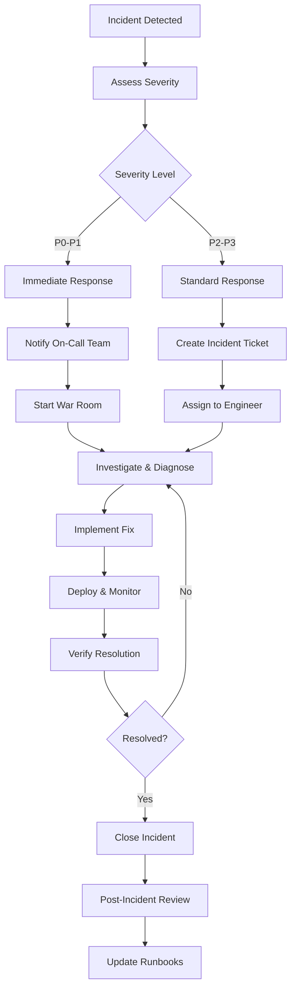

# Operations Runbook

## Overview

This runbook provides step-by-step procedures for common operational tasks in the RadhaGsareees e-commerce platform. It covers inventory management, webhook handling, security operations, and troubleshooting procedures.

## Table of Contents

1. [Inventory Management](#inventory-management)
2. [Webhook Operations](#webhook-operations)
3. [Security Operations](#security-operations)
4. [Database Operations](#database-operations)
5. [Monitoring & Alerting](#monitoring--alerting)
6. [Incident Response](#incident-response)
7. [Backup & Recovery](#backup--recovery)

## Inventory Management

### Reset Product Inventory

#### When to Use
- Stock count discrepancies
- Physical inventory reconciliation
- System migration or data corruption
- Bulk inventory adjustments

#### Prerequisites
- Admin access to the system
- Physical inventory count completed
- Backup of current inventory data

#### Procedure

```bash
# 1. Connect to the database
psql $DATABASE_URL

# 2. Create backup of current inventory
CREATE TABLE inventory_backup_$(date +%Y%m%d) AS 
SELECT * FROM products;

CREATE TABLE inventory_transactions_backup_$(date +%Y%m%d) AS 
SELECT * FROM inventory_transactions;
```

```sql
-- 3. Reset specific product inventory
UPDATE products 
SET stock_quantity = :new_stock_quantity,
    updated_at = NOW()
WHERE id = :product_id;

-- Record inventory adjustment transaction
INSERT INTO inventory_transactions (
    product_id,
    variant_id,
    type,
    quantity,
    previous_stock,
    new_stock,
    reason,
    metadata,
    created_at
) VALUES (
    :product_id,
    :variant_id,
    'ADJUSTMENT',
    :adjustment_quantity,
    :previous_stock,
    :new_stock,
    'Manual inventory reset - Physical count reconciliation',
    jsonb_build_object(
        'operator', :operator_name,
        'reference', :reference_number,
        'notes', :adjustment_notes
    ),
    NOW()
);
```

```typescript
// 4. Using the admin API endpoint
const resetInventory = async (adjustments: InventoryAdjustment[]) => {
  const response = await fetch('/api/admin/inventory/reset', {
    method: 'POST',
    headers: {
      'Content-Type': 'application/json',
      'Authorization': `Bearer ${adminToken}`,
    },
    body: JSON.stringify({
      adjustments,
      reason: 'Physical inventory reconciliation',
      reference: 'INV-2024-001',
    }),
  });
  
  if (!response.ok) {
    throw new Error('Inventory reset failed');
  }
  
  return response.json();
};

// Example usage
await resetInventory([
  {
    productId: 'prod_123',
    variantId: 'var_456', // optional
    newQuantity: 50,
    reason: 'Physical count shows 50 units',
  },
  {
    productId: 'prod_789',
    newQuantity: 0,
    reason: 'Product discontinued',
  },
]);
```

#### Verification Steps

```sql
-- Verify inventory changes
SELECT 
    p.name,
    p.sku,
    p.stock_quantity,
    it.previous_stock,
    it.new_stock,
    it.quantity,
    it.created_at
FROM products p
JOIN inventory_transactions it ON p.id = it.product_id
WHERE it.type = 'ADJUSTMENT'
  AND it.created_at >= NOW() - INTERVAL '1 hour'
ORDER BY it.created_at DESC;
```

#### Rollback Procedure

```sql
-- Rollback inventory changes if needed
UPDATE products 
SET stock_quantity = b.stock_quantity,
    updated_at = NOW()
FROM inventory_backup_$(date +%Y%m%d) b
WHERE products.id = b.id;

-- Mark rollback transactions
INSERT INTO inventory_transactions (
    product_id,
    type,
    quantity,
    previous_stock,
    new_stock,
    reason,
    created_at
)
SELECT 
    id,
    'ADJUSTMENT',
    stock_quantity - (SELECT stock_quantity FROM products WHERE id = b.id),
    (SELECT stock_quantity FROM products WHERE id = b.id),
    stock_quantity,
    'Rollback inventory reset',
    NOW()
FROM inventory_backup_$(date +%Y%m%d) b;
```

### Low Stock Alerts Management

```typescript
// Check and update low stock thresholds
const updateLowStockThresholds = async () => {
  const lowStockProducts = await prisma.product.findMany({
    where: {
      OR: [
        { stock_quantity: { lte: prisma.product.fields.lowStockThreshold } },
        { lowStockThreshold: null },
      ],
      status: 'ACTIVE',
    },
    select: {
      id: true,
      name: true,
      sku: true,
      stockQuantity: true,
      lowStockThreshold: true,
    },
  });
  
  console.log(`Found ${lowStockProducts.length} products needing attention`);
  
  // Send low stock alert
  await sendLowStockAlert(lowStockProducts);
};

// Set automatic reorder points
const setReorderPoints = async () => {
  await prisma.product.updateMany({
    where: { lowStockThreshold: null },
    data: { lowStockThreshold: 10 }, // Default threshold
  });
};
```

## Webhook Operations

### Replay Failed Webhooks

#### When to Use
- Payment webhook processing failures
- Temporary service outages
- Network connectivity issues
- Bug fixes in webhook handlers

#### Prerequisites
- Access to webhook events table
- Understanding of the original failure cause
- Backup of current webhook state

#### Procedure

```typescript
// 1. Identify failed webhooks
const getFailedWebhooks = async (
  provider: 'STRIPE' | 'RAZORPAY',
  startDate: Date,
  endDate: Date
) => {
  return prisma.webhookEvent.findMany({
    where: {
      provider,
      status: 'FAILED',
      createdAt: {
        gte: startDate,
        lte: endDate,
      },
    },
    orderBy: { createdAt: 'asc' },
  });
};

// 2. Replay webhook processing
const replayWebhook = async (webhookEventId: string) => {
  const webhookEvent = await prisma.webhookEvent.findUnique({
    where: { id: webhookEventId },
  });
  
  if (!webhookEvent) {
    throw new Error(`Webhook event ${webhookEventId} not found`);
  }
  
  if (webhookEvent.status === 'PROCESSED') {
    console.log(`Webhook ${webhookEventId} already processed`);
    return;
  }
  
  // Reset webhook status
  await prisma.webhookEvent.update({
    where: { id: webhookEventId },
    data: {
      status: 'PENDING',
      errorMessage: null,
      attemptCount: 0,
    },
  });
  
  try {
    // Reprocess based on provider
    if (webhookEvent.provider === 'STRIPE') {
      await handleStripeWebhook(webhookEvent.payload as any);
    } else if (webhookEvent.provider === 'RAZORPAY') {
      await handleRazorpayWebhook(webhookEvent.payload as any);
    }
    
    // Mark as processed
    await prisma.webhookEvent.update({
      where: { id: webhookEventId },
      data: {
        status: 'PROCESSED',
        processedAt: new Date(),
      },
    });
    
    console.log(`Successfully replayed webhook ${webhookEventId}`);
    
  } catch (error) {
    // Mark as failed again
    await prisma.webhookEvent.update({
      where: { id: webhookEventId },
      data: {
        status: 'FAILED',
        errorMessage: error.message,
        attemptCount: { increment: 1 },
      },
    });
    
    throw error;
  }
};

// 3. Bulk replay script
const replayFailedWebhooks = async (
  provider: 'STRIPE' | 'RAZORPAY',
  startDate: Date,
  endDate: Date,
  dryRun: boolean = true
) => {
  const failedWebhooks = await getFailedWebhooks(provider, startDate, endDate);
  
  console.log(`Found ${failedWebhooks.length} failed webhooks to replay`);
  
  if (dryRun) {
    console.log('DRY RUN - No webhooks will be replayed');
    failedWebhooks.forEach(webhook => {
      console.log(`Would replay: ${webhook.id} - ${webhook.eventType} - ${webhook.errorMessage}`);
    });
    return;
  }
  
  const results = {
    success: 0,
    failed: 0,
    errors: [] as string[],
  };
  
  for (const webhook of failedWebhooks) {
    try {
      await replayWebhook(webhook.id);
      results.success++;
      console.log(`✅ Replayed webhook ${webhook.id}`);
    } catch (error) {
      results.failed++;
      results.errors.push(`❌ Failed to replay ${webhook.id}: ${error.message}`);
      console.error(`Failed to replay webhook ${webhook.id}:`, error);
    }
    
    // Add delay between replays to avoid overwhelming the system
    await new Promise(resolve => setTimeout(resolve, 1000));
  }
  
  console.log(`Replay complete: ${results.success} success, ${results.failed} failed`);
  
  if (results.errors.length > 0) {
    console.log('Errors:');
    results.errors.forEach(error => console.log(error));
  }
  
  return results;
};
```

#### CLI Usage

```bash
# Replay failed Stripe webhooks from the last 24 hours
node scripts/replay-webhooks.js \
  --provider STRIPE \
  --start-date "2024-01-15T00:00:00Z" \
  --end-date "2024-01-16T00:00:00Z" \
  --dry-run

# Actual replay (remove --dry-run)
node scripts/replay-webhooks.js \
  --provider STRIPE \
  --start-date "2024-01-15T00:00:00Z" \
  --end-date "2024-01-16T00:00:00Z"
```

### Webhook Health Monitoring

```typescript
// Monitor webhook processing health
const monitorWebhookHealth = async () => {
  const last24Hours = new Date(Date.now() - 24 * 60 * 60 * 1000);
  
  const stats = await prisma.webhookEvent.groupBy({
    by: ['provider', 'status'],
    where: {
      createdAt: { gte: last24Hours },
    },
    _count: true,
  });
  
  const healthReport = {
    timestamp: new Date(),
    period: '24 hours',
    providers: {} as Record<string, any>,
  };
  
  stats.forEach(stat => {
    if (!healthReport.providers[stat.provider]) {
      healthReport.providers[stat.provider] = {
        total: 0,
        processed: 0,
        failed: 0,
        pending: 0,
        successRate: 0,
      };
    }
    
    const provider = healthReport.providers[stat.provider];
    provider.total += stat._count;
    provider[stat.status.toLowerCase()] += stat._count;
  });
  
  // Calculate success rates
  Object.values(healthReport.providers).forEach((provider: any) => {
    provider.successRate = provider.total > 0 
      ? (provider.processed / provider.total) * 100 
      : 0;
  });
  
  console.log('Webhook Health Report:', JSON.stringify(healthReport, null, 2));
  
  // Alert on low success rates
  Object.entries(healthReport.providers).forEach(([providerName, stats]: [string, any]) => {
    if (stats.successRate < 95 && stats.total > 10) {
      console.warn(`⚠️ Low webhook success rate for ${providerName}: ${stats.successRate.toFixed(2)}%`);
    }
  });
  
  return healthReport;
};
```

## Security Operations

### Rotate API Keys

#### When to Use
- Scheduled key rotation (quarterly)
- Security incident response
- Key compromise suspected
- Compliance requirements

#### Prerequisites
- Access to external service dashboards (Stripe, Razorpay, etc.)
- Environment variable management system
- Deployment pipeline access

#### Procedure

```typescript
// 1. JWT Secret Rotation
const rotateJWTSecret = async () => {
  const newSecret = crypto.randomBytes(64).toString('base64url');
  
  console.log('🔄 Rotating JWT secret...');
  
  // Update environment variable
  await updateEnvironmentVariable('NEXTAUTH_SECRET', newSecret);
  
  // Invalidate all existing sessions
  await prisma.session.deleteMany({});
  
  // Log the rotation
  await auditLog('SYSTEM_CONFIG_CHANGED', {
    action: 'JWT_SECRET_ROTATED',
    operator: 'system',
    timestamp: new Date(),
  });
  
  console.log('✅ JWT secret rotated successfully');
  console.log('⚠️ All users will need to sign in again');
};

// 2. Stripe Keys Rotation
const rotateStripeKeys = async () => {
  console.log('🔄 Rotating Stripe API keys...');
  
  // Note: This requires manual action in Stripe Dashboard
  console.log('Manual steps required:');
  console.log('1. Log into Stripe Dashboard');
  console.log('2. Go to Developers > API Keys');
  console.log('3. Create new secret key');
  console.log('4. Update STRIPE_SECRET_KEY environment variable');
  console.log('5. Update webhook endpoints if needed');
  console.log('6. Test payment functionality');
  
  // Verify current keys are working
  const stripe = new Stripe(process.env.STRIPE_SECRET_KEY!);
  
  try {
    await stripe.accounts.retrieve();
    console.log('✅ Current Stripe keys are valid');
  } catch (error) {
    console.error('❌ Stripe key validation failed:', error.message);
  }
};

// 3. Database Password Rotation
const rotateDatabasePassword = async () => {
  console.log('🔄 Rotating database password...');
  
  // This is environment-specific and depends on your database setup
  console.log('Manual steps required:');
  console.log('1. Generate new strong password');
  console.log('2. Update database user password');
  console.log('3. Update DATABASE_URL environment variable');
  console.log('4. Restart application instances');
  console.log('5. Verify database connectivity');
  
  // Test current database connection
  try {
    await prisma.$queryRaw`SELECT 1`;
    console.log('✅ Database connection is working');
  } catch (error) {
    console.error('❌ Database connection failed:', error.message);
  }
};

// 4. Webhook Secret Rotation
const rotateWebhookSecrets = async () => {
  console.log('🔄 Rotating webhook secrets...');
  
  // Generate new webhook secrets
  const newStripeSecret = `whsec_${crypto.randomBytes(32).toString('hex')}`;
  const newRazorpaySecret = crypto.randomBytes(32).toString('hex');
  
  console.log('Manual steps for Stripe:');
  console.log('1. Go to Stripe Dashboard > Webhooks');
  console.log('2. Update webhook endpoint');
  console.log('3. Copy new signing secret');
  console.log(`4. Update STRIPE_WEBHOOK_SECRET to: ${newStripeSecret}`);
  
  console.log('Manual steps for Razorpay:');
  console.log('1. Go to Razorpay Dashboard > Webhooks');
  console.log('2. Update webhook endpoint');
  console.log('3. Update webhook secret');
  console.log(`4. Update RAZORPAY_WEBHOOK_SECRET to: ${newRazorpaySecret}`);
  
  await auditLog('SYSTEM_CONFIG_CHANGED', {
    action: 'WEBHOOK_SECRETS_ROTATED',
    operator: 'system',
    timestamp: new Date(),
  });
};

// 5. Complete key rotation procedure
const performKeyRotation = async () => {
  console.log('🚀 Starting complete key rotation procedure...');
  
  try {
    await rotateJWTSecret();
    await rotateStripeKeys();
    await rotateDatabasePassword();
    await rotateWebhookSecrets();
    
    console.log('✅ Key rotation procedure completed');
    console.log('📋 Please complete manual steps as indicated above');
    
  } catch (error) {
    console.error('❌ Key rotation failed:', error);
    throw error;
  }
};
```

#### CLI Usage

```bash
# Rotate specific keys
node scripts/rotate-keys.js --type jwt
node scripts/rotate-keys.js --type stripe
node scripts/rotate-keys.js --type database
node scripts/rotate-keys.js --type webhooks

# Rotate all keys
node scripts/rotate-keys.js --all
```

### User Access Management

```typescript
// Suspend user account
const suspendUser = async (userId: string, reason: string, operatorId: string) => {
  await prisma.$transaction(async (tx) => {
    // Update user status
    await tx.user.update({
      where: { id: userId },
      data: { 
        status: 'SUSPENDED',
        suspendedAt: new Date(),
        suspensionReason: reason,
      },
    });
    
    // Invalidate all sessions
    await tx.session.deleteMany({
      where: { userId },
    });
    
    // Log the action
    await auditLog('USER_SUSPENDED', {
      userId,
      reason,
      operatorId,
      timestamp: new Date(),
    });
  });
  
  console.log(`✅ User ${userId} has been suspended`);
};

// Restore user account
const restoreUser = async (userId: string, operatorId: string) => {
  await prisma.user.update({
    where: { id: userId },
    data: {
      status: 'ACTIVE',
      suspendedAt: null,
      suspensionReason: null,
    },
  });
  
  await auditLog('USER_RESTORED', {
    userId,
    operatorId,
    timestamp: new Date(),
  });
  
  console.log(`✅ User ${userId} has been restored`);
};

// Change user role
const changeUserRole = async (
  userId: string, 
  newRole: UserRole, 
  operatorId: string
) => {
  const user = await prisma.user.findUnique({
    where: { id: userId },
    select: { role: true, email: true },
  });
  
  if (!user) {
    throw new Error('User not found');
  }
  
  await prisma.user.update({
    where: { id: userId },
    data: { role: newRole },
  });
  
  await auditLog('USER_ROLE_CHANGED', {
    userId,
    previousRole: user.role,
    newRole,
    operatorId,
    userEmail: user.email,
    timestamp: new Date(),
  });
  
  console.log(`✅ User ${userId} role changed from ${user.role} to ${newRole}`);
};
```

## Database Operations

### Database Backup

```bash
#!/bin/bash
# scripts/backup-database.sh

set -e

# Configuration
BACKUP_DIR="/var/backups/radhagsareees"
DATE=$(date +%Y%m%d_%H%M%S)
BACKUP_FILE="radhagsareees_backup_${DATE}.sql"
RETENTION_DAYS=30

# Create backup directory if it doesn't exist
mkdir -p $BACKUP_DIR

# Perform backup
echo "🔄 Starting database backup..."
pg_dump $DATABASE_URL \
  --format=custom \
  --no-owner \
  --no-privileges \
  --verbose \
  --file="${BACKUP_DIR}/${BACKUP_FILE}"

# Compress backup
gzip "${BACKUP_DIR}/${BACKUP_FILE}"
COMPRESSED_FILE="${BACKUP_FILE}.gz"

echo "✅ Backup completed: ${COMPRESSED_FILE}"

# Verify backup integrity
echo "🔍 Verifying backup integrity..."
pg_restore --list "${BACKUP_DIR}/${COMPRESSED_FILE}" > /dev/null
echo "✅ Backup verification successful"

# Upload to cloud storage (optional)
if [ ! -z "$AWS_S3_BACKUP_BUCKET" ]; then
  echo "☁️ Uploading backup to S3..."
  aws s3 cp "${BACKUP_DIR}/${COMPRESSED_FILE}" \
    "s3://${AWS_S3_BACKUP_BUCKET}/database-backups/"
  echo "✅ Backup uploaded to S3"
fi

# Clean up old backups
echo "🧹 Cleaning up old backups..."
find $BACKUP_DIR -name "*.gz" -mtime +$RETENTION_DAYS -delete
echo "✅ Cleanup completed"

echo "📊 Backup summary:"
ls -lh "${BACKUP_DIR}/${COMPRESSED_FILE}"
```

### Database Restore

```bash
#!/bin/bash
# scripts/restore-database.sh

set -e

if [ $# -ne 1 ]; then
  echo "Usage: $0 <backup_file>"
  exit 1
fi

BACKUP_FILE=$1

if [ ! -f "$BACKUP_FILE" ]; then
  echo "Error: Backup file $BACKUP_FILE not found"
  exit 1
fi

echo "⚠️ WARNING: This will overwrite the current database!"
echo "Backup file: $BACKUP_FILE"
read -p "Are you sure you want to continue? (yes/no): " CONFIRM

if [ "$CONFIRM" != "yes" ]; then
  echo "Restore cancelled"
  exit 0
fi

# Create a backup of current database before restore
echo "🔄 Creating backup of current database..."
CURRENT_BACKUP="pre_restore_backup_$(date +%Y%m%d_%H%M%S).sql"
pg_dump $DATABASE_URL --format=custom > "/tmp/${CURRENT_BACKUP}"
echo "✅ Current database backed up to /tmp/${CURRENT_BACKUP}"

# Drop existing connections
echo "🔄 Terminating active connections..."
psql $DATABASE_URL -c "
  SELECT pg_terminate_backend(pg_stat_activity.pid)
  FROM pg_stat_activity
  WHERE pg_stat_activity.datname = current_database()
    AND pid <> pg_backend_pid();
"

# Restore database
echo "🔄 Restoring database from $BACKUP_FILE..."
if [[ $BACKUP_FILE == *.gz ]]; then
  gunzip -c "$BACKUP_FILE" | pg_restore --clean --if-exists --no-owner --no-privileges --verbose -d $DATABASE_URL
else
  pg_restore --clean --if-exists --no-owner --no-privileges --verbose -d $DATABASE_URL "$BACKUP_FILE"
fi

echo "✅ Database restore completed"

# Verify restore
echo "🔍 Verifying restore..."
RECORD_COUNT=$(psql $DATABASE_URL -t -c "SELECT COUNT(*) FROM users;")
echo "Users table contains $RECORD_COUNT records"

echo "✅ Database restore verification completed"
```

### Database Migration

```typescript
// Manual migration script example
// scripts/migrate-data.ts

import { PrismaClient } from '@prisma/client';

const prisma = new PrismaClient();

async function migrateProductImages() {
  console.log('🔄 Starting product images migration...');
  
  const products = await prisma.product.findMany({
    where: {
      // Find products with old image format
      images: { not: { has: 'migrated' } },
    },
  });
  
  console.log(`Found ${products.length} products to migrate`);
  
  for (const product of products) {
    try {
      const oldImages = product.images as any[];
      const newImages = oldImages.map(img => {
        if (typeof img === 'string') {
          return {
            url: img,
            alt: product.name,
            order: 0,
          };
        }
        return img;
      });
      
      await prisma.product.update({
        where: { id: product.id },
        data: { 
          images: [...newImages, { migrated: true }],
        },
      });
      
      console.log(`✅ Migrated product ${product.id}`);
      
    } catch (error) {
      console.error(`❌ Failed to migrate product ${product.id}:`, error);
    }
  }
  
  console.log('✅ Product images migration completed');
}

// Run migration
if (require.main === module) {
  migrateProductImages()
    .catch(console.error)
    .finally(() => prisma.$disconnect());
}
```

## Monitoring & Alerting

### Performance Monitoring

```typescript
// Performance monitoring script
// scripts/monitor-performance.ts

interface PerformanceMetrics {
  timestamp: Date;
  responseTime: {
    p50: number;
    p95: number;
    p99: number;
  };
  throughput: number;
  errorRate: number;
  activeConnections: number;
  memoryUsage: number;
  cpuUsage: number;
}

async function collectMetrics(): Promise<PerformanceMetrics> {
  // Database performance
  const dbStats = await prisma.$queryRaw`
    SELECT 
      COUNT(*) as active_connections,
      AVG(extract(epoch from (now() - query_start))) as avg_query_time
    FROM pg_stat_activity 
    WHERE state = 'active';
  ` as any[];

  // Application metrics (implement based on your monitoring setup)
  const appMetrics = await getApplicationMetrics();
  
  return {
    timestamp: new Date(),
    responseTime: appMetrics.responseTime,
    throughput: appMetrics.throughput,
    errorRate: appMetrics.errorRate,
    activeConnections: dbStats[0].active_connections,
    memoryUsage: process.memoryUsage().heapUsed / 1024 / 1024, // MB
    cpuUsage: await getCPUUsage(),
  };
}

async function checkHealthThresholds(metrics: PerformanceMetrics) {
  const alerts = [];
  
  if (metrics.responseTime.p95 > 2000) {
    alerts.push('High response time detected (P95 > 2s)');
  }
  
  if (metrics.errorRate > 0.05) {
    alerts.push('High error rate detected (> 5%)');
  }
  
  if (metrics.activeConnections > 80) {
    alerts.push('High database connection count');
  }
  
  if (metrics.memoryUsage > 512) {
    alerts.push('High memory usage detected (> 512MB)');
  }
  
  if (alerts.length > 0) {
    await sendAlert({
      severity: 'WARNING',
      message: 'Performance thresholds exceeded',
      details: alerts,
      metrics,
    });
  }
}

// Run monitoring
setInterval(async () => {
  try {
    const metrics = await collectMetrics();
    await checkHealthThresholds(metrics);
    
    console.log(`📊 Performance check - Response time: ${metrics.responseTime.p95}ms, Error rate: ${(metrics.errorRate * 100).toFixed(2)}%`);
    
  } catch (error) {
    console.error('❌ Performance monitoring failed:', error);
  }
}, 60000); // Check every minute
```

### Health Check Endpoints

```typescript
// app/api/health/route.ts
export async function GET() {
  const checks = {
    timestamp: new Date().toISOString(),
    status: 'healthy',
    version: process.env.npm_package_version || 'unknown',
    checks: {
      database: 'unknown',
      redis: 'unknown',
      external_services: 'unknown',
    },
  };
  
  try {
    // Database check
    await prisma.$queryRaw`SELECT 1`;
    checks.checks.database = 'healthy';
  } catch (error) {
    checks.checks.database = 'unhealthy';
    checks.status = 'unhealthy';
  }
  
  try {
    // Redis check
    await redis.ping();
    checks.checks.redis = 'healthy';
  } catch (error) {
    checks.checks.redis = 'unhealthy';
    checks.status = 'unhealthy';
  }
  
  try {
    // External services check
    const stripe = new Stripe(process.env.STRIPE_SECRET_KEY!);
    await stripe.accounts.retrieve();
    checks.checks.external_services = 'healthy';
  } catch (error) {
    checks.checks.external_services = 'degraded';
  }
  
  const statusCode = checks.status === 'healthy' ? 200 : 503;
  
  return Response.json(checks, { status: statusCode });
}
```

## Incident Response

### Incident Response Playbook

#### Severity Levels

| Severity | Description | Response Time | Examples |
|----------|-------------|---------------|----------|
| P0 - Critical | System down, data loss | 15 minutes | Site unavailable, payment failures |
| P1 - High | Major functionality impacted | 1 hour | Try-on not working, checkout issues |
| P2 - Medium | Minor functionality impacted | 4 hours | Slow page loads, minor UI bugs |
| P3 - Low | Enhancement requests | 1 business day | Feature requests, cosmetic issues |

#### Incident Response Steps



#### Common Incident Scenarios

##### Database Connection Issues

```typescript
// Diagnosis commands
const diagnoseDatabaseIssues = async () => {
  try {
    // Check connection
    const startTime = Date.now();
    await prisma.$queryRaw`SELECT 1`;
    const connectionTime = Date.now() - startTime;
    
    console.log(`Database connection time: ${connectionTime}ms`);
    
    // Check active connections
    const connections = await prisma.$queryRaw`
      SELECT count(*) as total,
             count(*) FILTER (WHERE state = 'active') as active,
             count(*) FILTER (WHERE state = 'idle') as idle
      FROM pg_stat_activity;
    `;
    
    console.log('Database connections:', connections);
    
    // Check for long-running queries
    const longQueries = await prisma.$queryRaw`
      SELECT pid, now() - pg_stat_activity.query_start AS duration, query 
      FROM pg_stat_activity 
      WHERE (now() - pg_stat_activity.query_start) > interval '5 minutes'
        AND state = 'active';
    `;
    
    console.log('Long-running queries:', longQueries);
    
  } catch (error) {
    console.error('Database diagnosis failed:', error);
  }
};

// Emergency database actions
const emergencyDatabaseActions = async () => {
  try {
    // Kill long-running queries
    await prisma.$executeRaw`
      SELECT pg_terminate_backend(pid)
      FROM pg_stat_activity 
      WHERE (now() - pg_stat_activity.query_start) > interval '10 minutes'
        AND state = 'active'
        AND pid <> pg_backend_pid();
    `;
    
    console.log('✅ Long-running queries terminated');
    
  } catch (error) {
    console.error('Emergency database actions failed:', error);
  }
};
```

##### Payment Processing Issues

```typescript
// Payment system diagnosis
const diagnosePaymentIssues = async () => {
  // Check recent payment failures
  const failedPayments = await prisma.order.findMany({
    where: {
      status: 'CANCELLED',
      createdAt: {
        gte: new Date(Date.now() - 60 * 60 * 1000), // Last hour
      },
    },
    include: {
      items: true,
    },
    orderBy: { createdAt: 'desc' },
    take: 10,
  });
  
  console.log(`Found ${failedPayments.length} failed payments in the last hour`);
  
  // Check webhook processing status
  const webhookStats = await prisma.webhookEvent.groupBy({
    by: ['status', 'provider'],
    where: {
      createdAt: {
        gte: new Date(Date.now() - 60 * 60 * 1000),
      },
    },
    _count: true,
  });
  
  console.log('Webhook processing stats:', webhookStats);
  
  // Test payment provider connectivity
  try {
    const stripe = new Stripe(process.env.STRIPE_SECRET_KEY!);
    await stripe.accounts.retrieve();
    console.log('✅ Stripe connectivity OK');
  } catch (error) {
    console.error('❌ Stripe connectivity failed:', error);
  }
};

// Emergency payment actions
const emergencyPaymentActions = async () => {
  // Disable payment processing temporarily
  await prisma.systemConfig.upsert({
    where: { key: 'payments_enabled' },
    create: { key: 'payments_enabled', value: 'false' },
    update: { value: 'false' },
  });
  
  console.log('⚠️ Payment processing disabled');
  
  // Enable maintenance mode
  await prisma.systemConfig.upsert({
    where: { key: 'maintenance_mode' },
    create: { key: 'maintenance_mode', value: 'true' },
    update: { value: 'true' },
  });
  
  console.log('🚨 Maintenance mode enabled');
};
```

### Recovery Procedures

```bash
#!/bin/bash
# Emergency recovery script
# scripts/emergency-recovery.sh

set -e

echo "🚨 Starting emergency recovery procedures..."

# 1. Check system health
echo "🔍 Checking system health..."
curl -f http://localhost:3000/api/health || echo "❌ Health check failed"

# 2. Restart services
echo "🔄 Restarting services..."
pm2 restart all || docker-compose restart || echo "❌ Service restart failed"

# 3. Check database connectivity
echo "🔍 Checking database..."
psql $DATABASE_URL -c "SELECT 1;" || echo "❌ Database check failed"

# 4. Check Redis connectivity
echo "🔍 Checking Redis..."
redis-cli ping || echo "❌ Redis check failed"

# 5. Clear problematic cache
echo "🧹 Clearing cache..."
redis-cli flushdb || echo "❌ Cache clear failed"

# 6. Verify critical endpoints
echo "🔍 Verifying critical endpoints..."
curl -f http://localhost:3000/api/products?limit=1 || echo "❌ Products API failed"
curl -f http://localhost:3000/api/auth/session || echo "❌ Auth API failed"

echo "✅ Emergency recovery procedures completed"
echo "📋 Manual verification still required"
```

This runbook provides comprehensive operational procedures for managing the RadhaGsareees platform. Each section includes both automated scripts and manual procedures, with proper error handling and logging throughout. The procedures are designed to be executed by operations teams with varying levels of technical expertise.