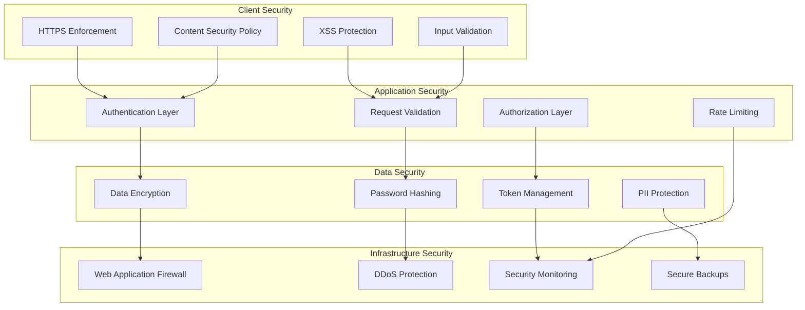

# Security Model & Implementation

## Security Architecture Overview

The RadhaGsareees platform implements a multi-layered security approach covering authentication, authorization, data protection, and infrastructure security.



## Authentication & Authorization

### NextAuth.js Implementation

#### Configuration
```typescript
// next-auth configuration
export const authOptions: NextAuthOptions = {
  providers: [
    GoogleProvider({
      clientId: process.env.GOOGLE_CLIENT_ID!,
      clientSecret: process.env.GOOGLE_CLIENT_SECRET!,
    }),
    GitHubProvider({
      clientId: process.env.GITHUB_CLIENT_ID!,
      clientSecret: process.env.GITHUB_CLIENT_SECRET!,
    }),
    CredentialsProvider({
      name: "credentials",
      credentials: {
        email: { label: "Email", type: "email" },
        password: { label: "Password", type: "password" }
      },
      async authorize(credentials) {
        if (!credentials?.email || !credentials?.password) {
          return null;
        }
        
        const user = await verifyCredentials(
          credentials.email,
          credentials.password
        );
        
        if (user) {
          return {
            id: user.id,
            email: user.email,
            name: user.name,
            role: user.role,
          };
        }
        
        return null;
      },
    }),
  ],
  
  adapter: PrismaAdapter(prisma),
  
  session: {
    strategy: "jwt",
    maxAge: 30 * 24 * 60 * 60, // 30 days
  },
  
  jwt: {
    secret: process.env.NEXTAUTH_SECRET,
    maxAge: 30 * 24 * 60 * 60, // 30 days
  },
  
  callbacks: {
    async jwt({ token, user, account }) {
      if (user) {
        token.role = user.role;
        token.id = user.id;
      }
      return token;
    },
    
    async session({ session, token }) {
      if (token) {
        session.user.id = token.id as string;
        session.user.role = token.role as UserRole;
      }
      return session;
    },
  },
  
  pages: {
    signIn: '/auth/signin',
    signUp: '/auth/signup',
    error: '/auth/error',
  },
  
  events: {
    async signIn({ user, account, isNewUser }) {
      await auditLog('USER_SIGNIN', {
        userId: user.id,
        provider: account?.provider,
        isNewUser,
        timestamp: new Date(),
      });
    },
    
    async signOut({ token }) {
      await auditLog('USER_SIGNOUT', {
        userId: token?.id,
        timestamp: new Date(),
      });
    },
  },
};
```

#### Password Security
```typescript
import bcrypt from 'bcryptjs';
import { z } from 'zod';

// Password validation schema
const passwordSchema = z.string()
  .min(8, 'Password must be at least 8 characters')
  .max(128, 'Password must not exceed 128 characters')
  .regex(/^(?=.*[a-z])(?=.*[A-Z])(?=.*\d)(?=.*[@$!%*?&])[A-Za-z\d@$!%*?&]/, 
    'Password must contain uppercase, lowercase, number, and special character');

// Secure password hashing
export async function hashPassword(password: string): Promise<string> {
  const validatedPassword = passwordSchema.parse(password);
  const saltRounds = 12;
  return bcrypt.hash(validatedPassword, saltRounds);
}

// Password verification
export async function verifyPassword(
  password: string, 
  hashedPassword: string
): Promise<boolean> {
  return bcrypt.compare(password, hashedPassword);
}

// Secure credential verification
export async function verifyCredentials(
  email: string, 
  password: string
): Promise<User | null> {
  // Rate limit authentication attempts
  await rateLimitAuth(email);
  
  const user = await prisma.user.findUnique({
    where: { email: email.toLowerCase() },
  });
  
  if (!user || !user.password) {
    // Prevent timing attacks with dummy verification
    await bcrypt.compare(password, '$2b$12$dummy.hash.to.prevent.timing.attacks');
    return null;
  }
  
  const isValidPassword = await verifyPassword(password, user.password);
  
  if (!isValidPassword) {
    await logFailedAttempt(email);
    return null;
  }
  
  await logSuccessfulAttempt(user.id);
  return user;
}
```

### Role-Based Access Control (RBAC)

```typescript
// User roles and permissions
enum UserRole {
  CUSTOMER = 'CUSTOMER',
  ADMIN = 'ADMIN',
  SUPER_ADMIN = 'SUPER_ADMIN',
}

enum Permission {
  // Product management
  CREATE_PRODUCT = 'CREATE_PRODUCT',
  UPDATE_PRODUCT = 'UPDATE_PRODUCT',
  DELETE_PRODUCT = 'DELETE_PRODUCT',
  MANAGE_INVENTORY = 'MANAGE_INVENTORY',
  
  // Order management
  VIEW_ALL_ORDERS = 'VIEW_ALL_ORDERS',
  UPDATE_ORDER_STATUS = 'UPDATE_ORDER_STATUS',
  PROCESS_REFUNDS = 'PROCESS_REFUNDS',
  
  // User management
  VIEW_ALL_USERS = 'VIEW_ALL_USERS',
  MANAGE_USERS = 'MANAGE_USERS',
  
  // Analytics
  VIEW_ANALYTICS = 'VIEW_ANALYTICS',
  EXPORT_DATA = 'EXPORT_DATA',
  
  // System administration
  MANAGE_SETTINGS = 'MANAGE_SETTINGS',
  ACCESS_LOGS = 'ACCESS_LOGS',
}

// Role-permission mapping
const ROLE_PERMISSIONS: Record<UserRole, Permission[]> = {
  [UserRole.CUSTOMER]: [],
  
  [UserRole.ADMIN]: [
    Permission.CREATE_PRODUCT,
    Permission.UPDATE_PRODUCT,
    Permission.MANAGE_INVENTORY,
    Permission.VIEW_ALL_ORDERS,
    Permission.UPDATE_ORDER_STATUS,
    Permission.VIEW_ANALYTICS,
  ],
  
  [UserRole.SUPER_ADMIN]: [
    ...ROLE_PERMISSIONS[UserRole.ADMIN],
    Permission.DELETE_PRODUCT,
    Permission.PROCESS_REFUNDS,
    Permission.VIEW_ALL_USERS,
    Permission.MANAGE_USERS,
    Permission.EXPORT_DATA,
    Permission.MANAGE_SETTINGS,
    Permission.ACCESS_LOGS,
  ],
};

// Permission checking middleware
export function requirePermission(permission: Permission) {
  return async (req: NextRequest, res: NextResponse) => {
    const session = await getServerSession(authOptions);
    
    if (!session?.user) {
      return NextResponse.json({ error: 'Unauthorized' }, { status: 401 });
    }
    
    const userPermissions = ROLE_PERMISSIONS[session.user.role as UserRole] || [];
    
    if (!userPermissions.includes(permission)) {
      await auditLog('PERMISSION_DENIED', {
        userId: session.user.id,
        permission,
        route: req.url,
        timestamp: new Date(),
      });
      
      return NextResponse.json({ error: 'Forbidden' }, { status: 403 });
    }
    
    // Permission granted, continue to route handler
    return NextResponse.next();
  };
}
```

## API Security

### Request Validation & Sanitization

```typescript
import { z } from 'zod';
import DOMPurify from 'isomorphic-dompurify';

// Input validation schemas
const createProductSchema = z.object({
  name: z.string()
    .min(1, 'Name is required')
    .max(255, 'Name too long')
    .transform(val => DOMPurify.sanitize(val)),
  
  description: z.string()
    .max(5000, 'Description too long')
    .transform(val => DOMPurify.sanitize(val)),
  
  basePrice: z.number()
    .positive('Price must be positive')
    .max(1000000, 'Price too high'),
  
  categoryId: z.string().uuid('Invalid category ID'),
  
  images: z.array(z.string().url('Invalid image URL'))
    .min(1, 'At least one image required')
    .max(10, 'Too many images'),
  
  specifications: z.record(z.string(), z.any())
    .refine(specs => Object.keys(specs).length <= 50, 'Too many specifications'),
});

// Validation middleware
export function validateRequest<T>(schema: z.ZodSchema<T>) {
  return async (req: NextRequest) => {
    try {
      const body = await req.json();
      const validatedData = schema.parse(body);
      
      // Attach validated data to request
      (req as any).validatedData = validatedData;
      
      return NextResponse.next();
    } catch (error) {
      if (error instanceof z.ZodError) {
        return NextResponse.json({
          error: 'Invalid request data',
          details: error.errors,
        }, { status: 400 });
      }
      
      return NextResponse.json({
        error: 'Request validation failed',
      }, { status: 400 });
    }
  };
}

// SQL injection prevention (using Prisma)
export async function safeQuery(userId: string, orderBy: string, limit: number) {
  // Prisma automatically prevents SQL injection
  // But we still validate inputs
  const validatedUserId = z.string().uuid().parse(userId);
  const validatedOrderBy = z.enum(['createdAt', 'updatedAt', 'name']).parse(orderBy);
  const validatedLimit = z.number().min(1).max(100).parse(limit);
  
  return prisma.product.findMany({
    where: { userId: validatedUserId },
    orderBy: { [validatedOrderBy]: 'desc' },
    take: validatedLimit,
  });
}
```

### Rate Limiting

```typescript
import { Redis } from 'ioredis';

const redis = new Redis(process.env.REDIS_URL!);

interface RateLimitConfig {
  windowMs: number;  // Time window in milliseconds
  maxRequests: number; // Max requests per window
  skipSuccessfulRequests?: boolean;
  skipFailedRequests?: boolean;
  keyGenerator?: (req: NextRequest) => string;
}

// Rate limiting configurations
const RATE_LIMITS: Record<string, RateLimitConfig> = {
  // Global API rate limit
  api: {
    windowMs: 15 * 60 * 1000, // 15 minutes
    maxRequests: 1000,
  },
  
  // Authentication endpoints
  auth: {
    windowMs: 15 * 60 * 1000, // 15 minutes
    maxRequests: 5,
    skipSuccessfulRequests: true,
  },
  
  // Try-on submissions
  tryOn: {
    windowMs: 60 * 1000, // 1 minute
    maxRequests: 10,
  },
  
  // Order creation
  orders: {
    windowMs: 60 * 1000, // 1 minute
    maxRequests: 3,
  },
  
  // Admin actions
  admin: {
    windowMs: 60 * 1000, // 1 minute
    maxRequests: 100,
  },
};

// Rate limiting middleware
export function rateLimit(configKey: keyof typeof RATE_LIMITS) {
  const config = RATE_LIMITS[configKey];
  
  return async (req: NextRequest) => {
    const key = config.keyGenerator?.(req) || getClientIP(req);
    const identifier = `rate_limit:${configKey}:${key}`;
    
    try {
      const current = await redis.get(identifier);
      const currentCount = parseInt(current || '0', 10);
      
      if (currentCount >= config.maxRequests) {
        return NextResponse.json({
          error: 'Rate limit exceeded',
          retryAfter: Math.ceil(config.windowMs / 1000),
        }, { 
          status: 429,
          headers: {
            'X-RateLimit-Limit': config.maxRequests.toString(),
            'X-RateLimit-Remaining': '0',
            'X-RateLimit-Reset': (Date.now() + config.windowMs).toString(),
          },
        });
      }
      
      // Increment counter
      const pipeline = redis.pipeline();
      pipeline.incr(identifier);
      pipeline.expire(identifier, Math.ceil(config.windowMs / 1000));
      await pipeline.exec();
      
      // Add rate limit headers
      const response = NextResponse.next();
      response.headers.set('X-RateLimit-Limit', config.maxRequests.toString());
      response.headers.set('X-RateLimit-Remaining', (config.maxRequests - currentCount - 1).toString());
      response.headers.set('X-RateLimit-Reset', (Date.now() + config.windowMs).toString());
      
      return response;
    } catch (error) {
      console.error('Rate limiting error:', error);
      // Allow request on Redis failure (fail open)
      return NextResponse.next();
    }
  };
}

// IP extraction utility
function getClientIP(req: NextRequest): string {
  const forwarded = req.headers.get('x-forwarded-for');
  const realIP = req.headers.get('x-real-ip');
  
  if (forwarded) {
    return forwarded.split(',')[0].trim();
  }
  
  if (realIP) {
    return realIP;
  }
  
  return 'unknown';
}
```

## Webhook Security

### Stripe Webhook Verification

```typescript
import { headers } from 'next/headers';
import Stripe from 'stripe';

const stripe = new Stripe(process.env.STRIPE_SECRET_KEY!, {
  apiVersion: '2023-10-16',
});

export async function POST(request: Request) {
  const body = await request.text();
  const signature = headers().get('stripe-signature');
  
  if (!signature) {
    return new Response('Missing signature', { status: 400 });
  }
  
  try {
    // Verify webhook signature
    const event = stripe.webhooks.constructEvent(
      body,
      signature,
      process.env.STRIPE_WEBHOOK_SECRET!
    );
    
    // Process webhook with idempotency
    const processed = await processWebhookEvent(event);
    
    if (processed) {
      return new Response('Webhook processed', { status: 200 });
    } else {
      return new Response('Webhook already processed', { status: 200 });
    }
    
  } catch (error) {
    console.error('Webhook signature verification failed:', error);
    
    // Log security incident
    await auditLog('WEBHOOK_VERIFICATION_FAILED', {
      provider: 'stripe',
      signature,
      error: error.message,
      timestamp: new Date(),
    });
    
    return new Response('Invalid signature', { status: 400 });
  }
}

// Idempotent webhook processing
async function processWebhookEvent(event: Stripe.Event): Promise<boolean> {
  const existingEvent = await prisma.webhookEvent.findUnique({
    where: { externalId: event.id },
  });
  
  if (existingEvent && existingEvent.status === 'PROCESSED') {
    return false; // Already processed
  }
  
  // Store webhook event for processing
  const webhookEvent = await prisma.webhookEvent.upsert({
    where: { externalId: event.id },
    create: {
      provider: 'STRIPE',
      eventType: event.type,
      externalId: event.id,
      payload: event.data,
      status: 'PROCESSING',
    },
    update: {
      status: 'PROCESSING',
      attemptCount: { increment: 1 },
    },
  });
  
  try {
    // Process the webhook based on event type
    await handleStripeEvent(event);
    
    // Mark as processed
    await prisma.webhookEvent.update({
      where: { id: webhookEvent.id },
      data: {
        status: 'PROCESSED',
        processedAt: new Date(),
      },
    });
    
    return true;
  } catch (error) {
    // Mark as failed
    await prisma.webhookEvent.update({
      where: { id: webhookEvent.id },
      data: {
        status: 'FAILED',
        errorMessage: error.message,
      },
    });
    
    throw error;
  }
}
```

### Razorpay Webhook Verification

```typescript
import crypto from 'crypto';

export async function POST(request: Request) {
  const body = await request.text();
  const signature = headers().get('x-razorpay-signature');
  
  if (!signature) {
    return new Response('Missing signature', { status: 400 });
  }
  
  try {
    // Verify Razorpay webhook signature
    const expectedSignature = crypto
      .createHmac('sha256', process.env.RAZORPAY_WEBHOOK_SECRET!)
      .update(body)
      .digest('hex');
    
    if (signature !== expectedSignature) {
      throw new Error('Invalid signature');
    }
    
    const event = JSON.parse(body);
    
    // Process webhook with idempotency
    const processed = await processRazorpayWebhook(event);
    
    return new Response('Webhook processed', { status: 200 });
    
  } catch (error) {
    console.error('Razorpay webhook verification failed:', error);
    
    await auditLog('WEBHOOK_VERIFICATION_FAILED', {
      provider: 'razorpay',
      signature,
      error: error.message,
      timestamp: new Date(),
    });
    
    return new Response('Invalid signature', { status: 400 });
  }
}
```

## Data Protection

### Encryption at Rest

```typescript
import { createCipheriv, createDecipheriv, randomBytes, pbkdf2Sync } from 'crypto';

class DataEncryption {
  private algorithm = 'aes-256-gcm';
  private keyLength = 32;
  private ivLength = 16;
  private saltLength = 64;
  private tagLength = 16;
  
  private deriveKey(password: string, salt: Buffer): Buffer {
    return pbkdf2Sync(password, salt, 100000, this.keyLength, 'sha512');
  }
  
  encrypt(plaintext: string, password: string): string {
    const salt = randomBytes(this.saltLength);
    const iv = randomBytes(this.ivLength);
    const key = this.deriveKey(password, salt);
    
    const cipher = createCipheriv(this.algorithm, key, iv);
    
    let encrypted = cipher.update(plaintext, 'utf8', 'base64');
    encrypted += cipher.final('base64');
    
    const tag = cipher.getAuthTag();
    
    // Combine salt, iv, tag, and encrypted data
    const combined = Buffer.concat([
      salt,
      iv,
      tag,
      Buffer.from(encrypted, 'base64'),
    ]);
    
    return combined.toString('base64');
  }
  
  decrypt(encryptedData: string, password: string): string {
    const combined = Buffer.from(encryptedData, 'base64');
    
    const salt = combined.subarray(0, this.saltLength);
    const iv = combined.subarray(this.saltLength, this.saltLength + this.ivLength);
    const tag = combined.subarray(
      this.saltLength + this.ivLength,
      this.saltLength + this.ivLength + this.tagLength
    );
    const encrypted = combined.subarray(this.saltLength + this.ivLength + this.tagLength);
    
    const key = this.deriveKey(password, salt);
    
    const decipher = createDecipheriv(this.algorithm, key, iv);
    decipher.setAuthTag(tag);
    
    let decrypted = decipher.update(encrypted, undefined, 'utf8');
    decrypted += decipher.final('utf8');
    
    return decrypted;
  }
}

// PII encryption utilities
const encryption = new DataEncryption();

export function encryptPII(data: string): string {
  return encryption.encrypt(data, process.env.PII_ENCRYPTION_KEY!);
}

export function decryptPII(encryptedData: string): string {
  return encryption.decrypt(encryptData, process.env.PII_ENCRYPTION_KEY!);
}
```

### Secure Headers

```typescript
// Security headers middleware
export function securityHeaders() {
  return (req: NextRequest) => {
    const response = NextResponse.next();
    
    // Content Security Policy
    response.headers.set('Content-Security-Policy', [
      "default-src 'self'",
      "script-src 'self' 'unsafe-eval' 'unsafe-inline' https://js.stripe.com https://checkout.razorpay.com",
      "style-src 'self' 'unsafe-inline' https://fonts.googleapis.com",
      "font-src 'self' https://fonts.gstatic.com",
      "img-src 'self' data: https: blob:",
      "media-src 'self' blob:",
      "connect-src 'self' https://api.stripe.com https://api.razorpay.com wss:",
      "frame-src 'self' https://js.stripe.com https://api.razorpay.com",
      "object-src 'none'",
      "base-uri 'self'",
      "form-action 'self'",
      "frame-ancestors 'none'",
      "upgrade-insecure-requests",
    ].join('; '));
    
    // Other security headers
    response.headers.set('X-Frame-Options', 'DENY');
    response.headers.set('X-Content-Type-Options', 'nosniff');
    response.headers.set('Referrer-Policy', 'strict-origin-when-cross-origin');
    response.headers.set('X-XSS-Protection', '1; mode=block');
    response.headers.set('Strict-Transport-Security', 'max-age=31536000; includeSubDomains; preload');
    response.headers.set('Permissions-Policy', 'camera=(*), microphone=(), geolocation=(), payment=()');
    
    return response;
  };
}
```

## Audit Logging & Monitoring

### Security Event Logging

```typescript
enum AuditEventType {
  // Authentication events
  USER_SIGNIN = 'USER_SIGNIN',
  USER_SIGNOUT = 'USER_SIGNOUT',
  AUTH_FAILURE = 'AUTH_FAILURE',
  PERMISSION_DENIED = 'PERMISSION_DENIED',
  
  // Data access events
  SENSITIVE_DATA_ACCESS = 'SENSITIVE_DATA_ACCESS',
  DATA_EXPORT = 'DATA_EXPORT',
  PII_ACCESS = 'PII_ACCESS',
  
  // Security incidents
  RATE_LIMIT_EXCEEDED = 'RATE_LIMIT_EXCEEDED',
  WEBHOOK_VERIFICATION_FAILED = 'WEBHOOK_VERIFICATION_FAILED',
  SUSPICIOUS_ACTIVITY = 'SUSPICIOUS_ACTIVITY',
  
  // Administrative actions
  USER_ROLE_CHANGED = 'USER_ROLE_CHANGED',
  SYSTEM_CONFIG_CHANGED = 'SYSTEM_CONFIG_CHANGED',
  PAYMENT_METHOD_ADDED = 'PAYMENT_METHOD_ADDED',
}

interface AuditLog {
  id: string;
  eventType: AuditEventType;
  userId?: string;
  sessionId?: string;
  ipAddress: string;
  userAgent: string;
  metadata: Record<string, any>;
  timestamp: Date;
  severity: 'LOW' | 'MEDIUM' | 'HIGH' | 'CRITICAL';
}

export async function auditLog(
  eventType: AuditEventType,
  metadata: Record<string, any>,
  severity: AuditLog['severity'] = 'MEDIUM'
): Promise<void> {
  const log: Omit<AuditLog, 'id'> = {
    eventType,
    userId: metadata.userId,
    sessionId: metadata.sessionId,
    ipAddress: metadata.ipAddress || 'unknown',
    userAgent: metadata.userAgent || 'unknown',
    metadata,
    timestamp: new Date(),
    severity,
  };
  
  try {
    // Store in database
    await prisma.auditLog.create({ data: log });
    
    // Send alerts for high-severity events
    if (severity === 'HIGH' || severity === 'CRITICAL') {
      await sendSecurityAlert(log);
    }
    
    // Log to external monitoring service
    if (process.env.NODE_ENV === 'production') {
      await sendToMonitoring(log);
    }
    
  } catch (error) {
    console.error('Failed to write audit log:', error);
    // Don't throw - logging failure shouldn't break the application
  }
}

// Security alerting
async function sendSecurityAlert(log: Omit<AuditLog, 'id'>): Promise<void> {
  // Send to security team via email/Slack
  // Implementation depends on chosen alerting service
  console.error('SECURITY ALERT:', log);
}

// Anomaly detection
class SecurityAnomalyDetector {
  async detectAnomalies(userId: string): Promise<boolean> {
    const recentLogs = await prisma.auditLog.findMany({
      where: {
        userId,
        timestamp: {
          gte: new Date(Date.now() - 24 * 60 * 60 * 1000), // Last 24 hours
        },
      },
      orderBy: { timestamp: 'desc' },
      take: 100,
    });
    
    // Check for suspicious patterns
    const failedLogins = recentLogs.filter(
      log => log.eventType === AuditEventType.AUTH_FAILURE
    ).length;
    
    const differentIPs = new Set(
      recentLogs.map(log => log.ipAddress)
    ).size;
    
    const rapidActions = recentLogs.filter(
      log => log.timestamp > new Date(Date.now() - 5 * 60 * 1000) // Last 5 minutes
    ).length;
    
    // Anomaly thresholds
    const isAnomalous = 
      failedLogins > 5 ||
      differentIPs > 3 ||
      rapidActions > 20;
    
    if (isAnomalous) {
      await auditLog(AuditEventType.SUSPICIOUS_ACTIVITY, {
        userId,
        failedLogins,
        differentIPs,
        rapidActions,
        timestamp: new Date(),
      }, 'HIGH');
    }
    
    return isAnomalous;
  }
}
```

## Environment & Secrets Management

### Environment Variable Validation

```typescript
import { z } from 'zod';

// Environment schema
const envSchema = z.object({
  // Database
  DATABASE_URL: z.string().url(),
  
  // Authentication
  NEXTAUTH_SECRET: z.string().min(32),
  NEXTAUTH_URL: z.string().url(),
  
  // OAuth providers
  GOOGLE_CLIENT_ID: z.string(),
  GOOGLE_CLIENT_SECRET: z.string(),
  GITHUB_CLIENT_ID: z.string(),
  GITHUB_CLIENT_SECRET: z.string(),
  
  // Payment providers
  STRIPE_PUBLISHABLE_KEY: z.string().startsWith('pk_'),
  STRIPE_SECRET_KEY: z.string().startsWith('sk_'),
  STRIPE_WEBHOOK_SECRET: z.string().startsWith('whsec_'),
  
  RAZORPAY_KEY_ID: z.string(),
  RAZORPAY_KEY_SECRET: z.string(),
  RAZORPAY_WEBHOOK_SECRET: z.string(),
  
  // External services
  CLOUDINARY_URL: z.string().url(),
  REDIS_URL: z.string().url(),
  
  // Encryption
  PII_ENCRYPTION_KEY: z.string().min(32),
  
  // Feature flags
  NODE_ENV: z.enum(['development', 'production', 'test']),
  ENABLE_ANALYTICS: z.string().optional().transform(val => val === 'true'),
});

// Validate environment on startup
export function validateEnvironment() {
  try {
    const env = envSchema.parse(process.env);
    return env;
  } catch (error) {
    console.error('Environment validation failed:', error);
    process.exit(1);
  }
}

// Type-safe environment access
export const env = validateEnvironment();
```

### Secrets Rotation Strategy

```typescript
// Key rotation utilities
class SecretsManager {
  async rotateJWTSecret(): Promise<void> {
    const newSecret = generateSecureSecret(64);
    
    // Update in environment/secrets manager
    await updateSecret('NEXTAUTH_SECRET', newSecret);
    
    // Invalidate all existing sessions
    await prisma.session.deleteMany({});
    
    // Log rotation event
    await auditLog(AuditEventType.SYSTEM_CONFIG_CHANGED, {
      action: 'JWT_SECRET_ROTATED',
      timestamp: new Date(),
    }, 'MEDIUM');
  }
  
  async rotateWebhookSecrets(): Promise<void> {
    // Rotate Stripe webhook secret
    const newStripeSecret = await stripe.webhookEndpoints.update(
      process.env.STRIPE_WEBHOOK_ENDPOINT_ID!,
      { enabled_events: ['*'] } // This triggers secret regeneration
    );
    
    await updateSecret('STRIPE_WEBHOOK_SECRET', newStripeSecret.secret!);
    
    // Similar for Razorpay...
    
    await auditLog(AuditEventType.SYSTEM_CONFIG_CHANGED, {
      action: 'WEBHOOK_SECRETS_ROTATED',
      timestamp: new Date(),
    }, 'MEDIUM');
  }
}

function generateSecureSecret(length: number): string {
  return crypto.randomBytes(length).toString('base64url');
}
```

## Security Testing & Compliance

### Security Test Suite

```typescript
// Security-focused tests
describe('Security Tests', () => {
  describe('Authentication', () => {
    test('should reject weak passwords', async () => {
      const weakPasswords = ['123456', 'password', 'abc123'];
      
      for (const password of weakPasswords) {
        const response = await request(app)
          .post('/api/auth/register')
          .send({
            email: 'test@example.com',
            password,
            name: 'Test User',
          });
        
        expect(response.status).toBe(400);
        expect(response.body.error).toContain('Password');
      }
    });
    
    test('should rate limit authentication attempts', async () => {
      const promises = Array.from({ length: 10 }, () =>
        request(app)
          .post('/api/auth/signin')
          .send({
            email: 'test@example.com',
            password: 'wrongpassword',
          })
      );
      
      const responses = await Promise.all(promises);
      const rateLimitedResponses = responses.filter(r => r.status === 429);
      
      expect(rateLimitedResponses.length).toBeGreaterThan(0);
    });
  });
  
  describe('Input Validation', () => {
    test('should sanitize XSS attempts', async () => {
      const xssPayload = '<script>alert("xss")</script>';
      
      const response = await request(app)
        .post('/api/products')
        .set('Authorization', `Bearer ${adminToken}`)
        .send({
          name: xssPayload,
          description: 'Test product',
          basePrice: 100,
          categoryId: validCategoryId,
        });
      
      expect(response.status).toBe(201);
      expect(response.body.name).not.toContain('<script>');
    });
    
    test('should reject SQL injection attempts', async () => {
      const sqlPayload = "'; DROP TABLE users; --";
      
      const response = await request(app)
        .get(`/api/products/search?q=${encodeURIComponent(sqlPayload)}`);
      
      expect(response.status).toBe(400);
    });
  });
  
  describe('Authorization', () => {
    test('should enforce role-based access control', async () => {
      const response = await request(app)
        .delete('/api/products/123')
        .set('Authorization', `Bearer ${customerToken}`);
      
      expect(response.status).toBe(403);
    });
  });
});
```

### Compliance Checklist

```markdown
## Security Compliance Checklist

### OWASP Top 10 (2021)
- [x] A01: Broken Access Control - RBAC implemented
- [x] A02: Cryptographic Failures - Encryption at rest/transit
- [x] A03: Injection - Input validation with Zod
- [x] A04: Insecure Design - Security by design principles
- [x] A05: Security Misconfiguration - Secure defaults
- [x] A06: Vulnerable Components - Regular dependency updates
- [x] A07: Authentication Failures - Strong auth with NextAuth.js
- [x] A08: Software Integrity Failures - Package integrity checks
- [x] A09: Logging & Monitoring - Comprehensive audit logs
- [x] A10: SSRF - Input validation for URLs

### Data Protection (GDPR)
- [x] Right to Access - User data export
- [x] Right to Rectification - Profile updates
- [x] Right to Erasure - Account deletion
- [x] Right to Portability - Data export formats
- [x] Privacy by Design - Minimal data collection
- [x] Consent Management - Explicit consent flows

### PCI DSS (Payment Security)
- [x] Secure Network - HTTPS enforcement
- [x] Protect Cardholder Data - Tokenization via Stripe/Razorpay
- [x] Vulnerability Management - Regular security updates
- [x] Access Control - Strong authentication
- [x] Network Monitoring - Audit logging
- [x] Security Testing - Regular penetration testing
```