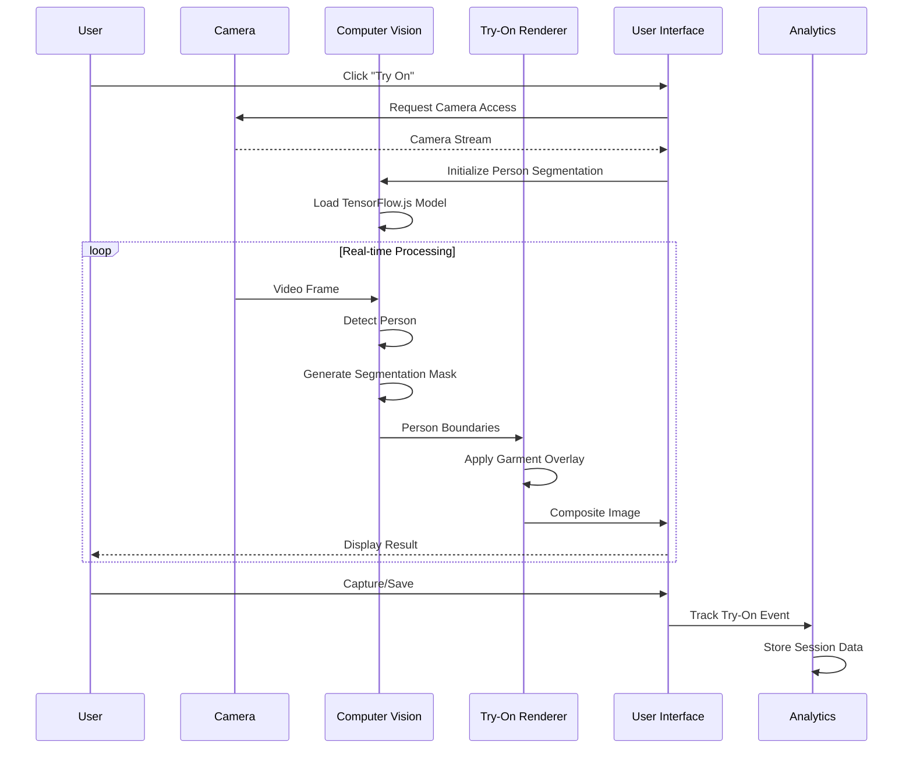
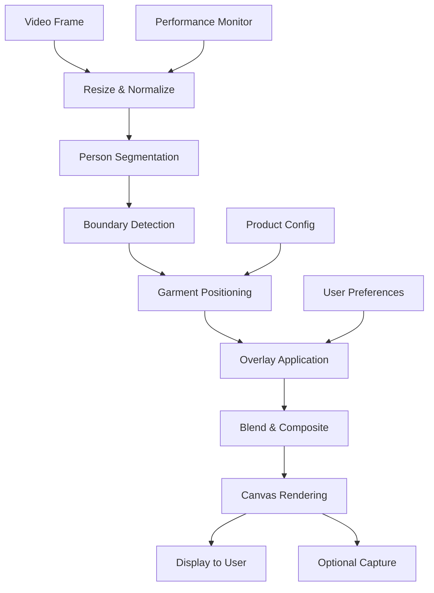
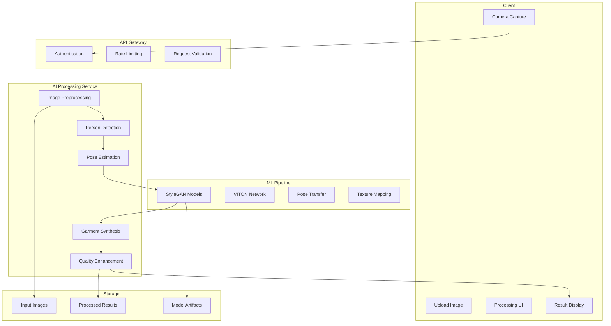

# Try-On Pipeline Documentation

## Overview

The RadhaGsareees virtual try-on system is designed as a progressive enhancement, starting with client-side overlay technology and planned evolution to server-side AI synthesis. This document outlines the current implementation and future roadmap.

## Current Implementation: Client-Side Overlay

### Architecture Flow



### Technical Implementation

#### Core Technologies
- **TensorFlow.js**: Client-side machine learning
- **BodyPix Model**: Real-time person segmentation
- **Canvas API**: Image composition and rendering
- **MediaDevices API**: Camera access and video streaming
- **WebGL**: Hardware-accelerated rendering

#### Component Architecture

```typescript
// Try-On Canvas Component Structure
interface TryOnCanvasProps {
  product: Product;
  variant?: ProductVariant;
  onCapture?: (image: string) => void;
  onError?: (error: Error) => void;
  debug?: boolean;
}

interface TryOnState {
  isLoading: boolean;
  isProcessing: boolean;
  hasPermission: boolean;
  error: string | null;
  model: bodyPix.BodyPixModel | null;
  lastFrameTime: number;
  fps: number;
}
```

#### Processing Pipeline



#### Segmentation Algorithm

```typescript
// Person segmentation configuration
const SEGMENTATION_CONFIG = {
  model: 'MobileNetV1', // Optimized for mobile devices
  multiplier: 0.75,     // Balance between speed and accuracy
  stride: 16,           // Processing resolution
  segmentationThreshold: 0.7, // Confidence threshold
  maxDetections: 1,     // Single person detection
  scoreThreshold: 0.5,  // Minimum detection score
  nmsRadius: 20,        // Non-maximum suppression
};

// Real-time processing optimization
const PERFORMANCE_CONFIG = {
  targetFPS: 30,        // Target frame rate
  maxProcessingTime: 33, // Max processing time per frame (ms)
  adaptiveQuality: true, // Reduce quality under load
  skipFrames: 0,        // Skip frames when overloaded
};
```

#### Overlay Rendering System

```typescript
// Garment overlay configuration per product
interface GarmentOverlay {
  type: 'saree' | 'lehenga' | 'kurti' | 'jewelry';
  anchorPoints: {
    shoulder: Point2D;
    waist: Point2D;
    hem: Point2D;
  };
  adjustments: {
    scale: number;        // Size adjustment
    rotation: number;     // Angle adjustment
    opacity: number;      // Transparency
    blendMode: string;    // Canvas blend mode
  };
  physics?: {
    draping: boolean;     // Simulate fabric draping
    wind: number;         // Wind effect strength
    gravity: number;      // Gravity effect
  };
}

// Rendering pipeline
class GarmentRenderer {
  private applyOverlay(
    ctx: CanvasRenderingContext2D,
    personMask: ImageData,
    garmentImage: HTMLImageElement,
    config: GarmentOverlay
  ): void {
    // 1. Calculate person dimensions
    const bounds = this.getPersonBounds(personMask);
    
    // 2. Position garment relative to person
    const position = this.calculateGarmentPosition(bounds, config);
    
    // 3. Apply transformations
    ctx.save();
    ctx.globalAlpha = config.adjustments.opacity;
    ctx.globalCompositeOperation = config.adjustments.blendMode;
    
    // 4. Render garment with physics simulation
    this.renderWithPhysics(ctx, garmentImage, position, config.physics);
    
    ctx.restore();
  }
}
```

### Performance Optimizations

#### Frame Rate Management
```typescript
// Adaptive frame rate controller
class FrameRateController {
  private targetFPS = 30;
  private lastFrameTime = 0;
  private frameInterval = 1000 / this.targetFPS;
  
  shouldProcessFrame(currentTime: number): boolean {
    if (currentTime - this.lastFrameTime >= this.frameInterval) {
      this.lastFrameTime = currentTime;
      return true;
    }
    return false;
  }
  
  adaptToPerformance(processingTime: number): void {
    if (processingTime > this.frameInterval) {
      // Reduce quality or skip frames
      this.reduceQuality();
    }
  }
}
```

#### Memory Management
```typescript
// Canvas and tensor cleanup
class MemoryManager {
  private canvasPool: HTMLCanvasElement[] = [];
  private tensorPool: tf.Tensor[] = [];
  
  getCanvas(width: number, height: number): HTMLCanvasElement {
    const canvas = this.canvasPool.pop() || document.createElement('canvas');
    canvas.width = width;
    canvas.height = height;
    return canvas;
  }
  
  releaseCanvas(canvas: HTMLCanvasElement): void {
    const ctx = canvas.getContext('2d');
    ctx?.clearRect(0, 0, canvas.width, canvas.height);
    this.canvasPool.push(canvas);
  }
  
  cleanup(): void {
    this.tensorPool.forEach(tensor => tensor.dispose());
    this.tensorPool = [];
  }
}
```

### User Experience Features

#### Accessibility Implementation
```typescript
// Screen reader announcements
const announceStatus = (status: string) => {
  const announcement = document.createElement('div');
  announcement.setAttribute('aria-live', 'polite');
  announcement.setAttribute('aria-atomic', 'true');
  announcement.textContent = status;
  announcement.className = 'sr-only';
  document.body.appendChild(announcement);
  
  setTimeout(() => document.body.removeChild(announcement), 1000);
};

// Keyboard navigation
const handleKeyboard = (event: KeyboardEvent) => {
  switch (event.code) {
    case 'Space':
      event.preventDefault();
      captureImage();
      announceStatus('Photo captured');
      break;
    case 'Escape':
      event.preventDefault();
      exitTryOn();
      announceStatus('Try-on mode exited');
      break;
  }
};
```

#### Mobile Optimization
```typescript
// Touch gesture handling
class TouchGestureHandler {
  handlePinch(scale: number): void {
    // Zoom garment overlay
    this.updateGarmentScale(scale);
  }
  
  handleRotation(angle: number): void {
    // Rotate garment for better fit
    this.updateGarmentRotation(angle);
  }
  
  handlePan(deltaX: number, deltaY: number): void {
    // Adjust garment position
    this.updateGarmentPosition(deltaX, deltaY);
  }
}

// Device orientation handling
const handleOrientationChange = () => {
  setTimeout(() => {
    resizeCanvas();
    reinitializeCamera();
  }, 100);
};
```

## Future Implementation: Server-Side AI Synthesis

### Planned Architecture



### AI Model Pipeline

#### Stage 1: Advanced Person Segmentation
```python
# Improved segmentation with DeepLabV3+
class AdvancedSegmentation:
    def __init__(self):
        self.model = load_model('deeplabv3_plus_mobilenet')
        self.refinement = load_model('segmentation_refinement')
    
    def segment_person(self, image):
        # Initial segmentation
        coarse_mask = self.model.predict(image)
        
        # Boundary refinement
        refined_mask = self.refinement.predict({
            'image': image,
            'coarse_mask': coarse_mask
        })
        
        return refined_mask
```

#### Stage 2: 3D Pose Estimation
```python
# 3D body pose estimation
class PoseEstimation:
    def __init__(self):
        self.model = load_model('human3d_pose_estimation')
    
    def estimate_3d_pose(self, image, person_mask):
        # Extract 2D keypoints
        keypoints_2d = self.detect_2d_keypoints(image, person_mask)
        
        # Lift to 3D space
        keypoints_3d = self.model.predict(keypoints_2d)
        
        # Estimate body measurements
        measurements = self.calculate_body_measurements(keypoints_3d)
        
        return {
            'keypoints_3d': keypoints_3d,
            'measurements': measurements,
            'confidence': self.calculate_confidence(keypoints_2d, keypoints_3d)
        }
```

#### Stage 3: Virtual Garment Fitting
```python
# VITON-based garment synthesis
class GarmentSynthesis:
    def __init__(self):
        self.parser = load_model('human_parser')
        self.generator = load_model('garment_generator')
        self.compositor = load_model('image_compositor')
    
    def synthesize_garment(self, person_image, garment_image, pose_data):
        # Parse human body parts
        body_parts = self.parser.predict(person_image)
        
        # Warp garment to fit person
        warped_garment = self.warp_garment_to_pose(
            garment_image, 
            pose_data['keypoints_3d'],
            pose_data['measurements']
        )
        
        # Generate realistic try-on result
        try_on_result = self.generator.predict({
            'person': person_image,
            'garment': warped_garment,
            'body_parts': body_parts,
            'pose': pose_data['keypoints_3d']
        })
        
        # Composite final image
        final_result = self.compositor.predict({
            'background': person_image,
            'foreground': try_on_result,
            'mask': body_parts
        })
        
        return final_result
```

### API Design

```typescript
// Try-on API endpoints
interface TryOnAPI {
  // Submit try-on request
  POST: '/api/try-on/submit' {
    body: {
      personImage: string; // Base64 or file upload
      garmentId: string;
      options?: {
        quality: 'fast' | 'standard' | 'high';
        format: 'jpg' | 'png';
        resolution: number;
      };
    };
    response: {
      requestId: string;
      estimatedTime: number; // seconds
      status: 'queued' | 'processing' | 'completed' | 'failed';
    };
  };
  
  // Check processing status
  GET: '/api/try-on/status/{requestId}' {
    response: {
      requestId: string;
      status: 'queued' | 'processing' | 'completed' | 'failed';
      progress: number; // 0-100
      result?: {
        imageUrl: string;
        confidence: number;
        processingTime: number;
      };
      error?: string;
    };
  };
  
  // Get processed result
  GET: '/api/try-on/result/{requestId}' {
    response: {
      imageUrl: string;
      thumbnailUrl: string;
      metadata: {
        confidence: number;
        processingTime: number;
        modelVersion: string;
      };
    };
  };
}
```

### Processing Queue System

```typescript
// Redis-based job queue
interface TryOnJob {
  id: string;
  userId: string;
  personImage: string;
  garmentId: string;
  options: ProcessingOptions;
  status: 'queued' | 'processing' | 'completed' | 'failed';
  priority: number;
  createdAt: Date;
  startedAt?: Date;
  completedAt?: Date;
  result?: {
    imageUrl: string;
    confidence: number;
    processingTime: number;
  };
  error?: string;
}

// Queue management
class TryOnQueue {
  async addJob(job: Omit<TryOnJob, 'id' | 'status' | 'createdAt'>): Promise<string> {
    const jobId = uuid();
    const queueJob: TryOnJob = {
      ...job,
      id: jobId,
      status: 'queued',
      createdAt: new Date(),
    };
    
    await redis.lpush('try_on_queue', JSON.stringify(queueJob));
    await redis.set(`try_on_job:${jobId}`, JSON.stringify(queueJob), 'EX', 3600);
    
    return jobId;
  }
  
  async processQueue(): Promise<void> {
    const job = await redis.brpop('try_on_queue', 10);
    if (job) {
      const tryOnJob: TryOnJob = JSON.parse(job[1]);
      await this.processJob(tryOnJob);
    }
  }
}
```

## Performance & Quality Metrics

### Current Client-Side Metrics

```typescript
interface TryOnMetrics {
  // Performance metrics
  frameRate: number;           // Current FPS
  processingLatency: number;   // Frame processing time (ms)
  memoryUsage: number;         // MB of memory used
  cpuUsage: number;           // CPU utilization %
  
  // Quality metrics
  segmentationAccuracy: number; // Person detection accuracy
  overlayAlignment: number;     // Garment positioning accuracy
  visualQuality: number;        // Subjective quality score
  
  // User experience
  sessionDuration: number;      // Try-on session length
  captureRate: number;         // Photos taken per session
  conversionRate: number;      // Try-on to purchase rate
}
```

### Future AI Metrics

```typescript
interface AITryOnMetrics {
  // Processing metrics
  queueWaitTime: number;       // Time in queue (seconds)
  processingTime: number;      // AI processing time (seconds)
  throughput: number;          // Jobs per minute
  
  // Quality metrics
  photoRealism: number;        // Generated image quality
  fitAccuracy: number;         // Garment fit correctness
  colorConsistency: number;    // Color reproduction accuracy
  textureDetail: number;       // Fabric texture preservation
  
  // Model performance
  modelLatency: number;        // Inference time per model
  gpuUtilization: number;      // GPU usage %
  modelAccuracy: number;       // Ground truth comparison
}
```

## Integration Points

### Analytics Integration
```typescript
// Try-on event tracking
const trackTryOnEvent = async (eventData: {
  userId?: string;
  productId: string;
  method: 'client' | 'server';
  duration: number;
  result: 'completed' | 'abandoned';
  quality?: number;
}) => {
  await analytics.track('try_on_session', {
    ...eventData,
    timestamp: new Date(),
    context: {
      device: getDeviceInfo(),
      performance: getPerformanceMetrics(),
    },
  });
};
```

### E-commerce Integration
```typescript
// Try-on to cart conversion
const handleTryOnCapture = async (capturedImage: string, productId: string) => {
  // Save captured image
  const imageUrl = await uploadImage(capturedImage);
  
  // Update product engagement
  await updateProductMetrics(productId, {
    tryOnCount: 1,
    captureCount: 1,
  });
  
  // Show purchase prompt
  showPurchasePrompt({
    productId,
    tryOnImage: imageUrl,
    personalizedMessage: 'You look great! Add this to your cart?',
  });
};
```

## Deployment & Scaling

### Client-Side Deployment
- **CDN Distribution**: TensorFlow.js models served via CDN
- **Progressive Loading**: Load models on-demand
- **Offline Support**: Cache models for offline try-on
- **Device Optimization**: Serve appropriate model size per device

### Server-Side Infrastructure (Future)
```yaml
# Kubernetes deployment for AI processing
apiVersion: apps/v1
kind: Deployment
metadata:
  name: try-on-processor
spec:
  replicas: 3
  selector:
    matchLabels:
      app: try-on-processor
  template:
    spec:
      containers:
      - name: processor
        image: radhagsareees/try-on-ai:v1.0.0
        resources:
          requests:
            memory: "4Gi"
            cpu: "2"
            nvidia.com/gpu: 1
          limits:
            memory: "8Gi"
            cpu: "4"
            nvidia.com/gpu: 1
        env:
        - name: REDIS_URL
          valueFrom:
            secretKeyRef:
              name: redis-secret
              key: url
```

## Testing Strategy

### Client-Side Testing
```typescript
// Jest tests for try-on components
describe('TryOnCanvas', () => {
  test('should initialize camera successfully', async () => {
    const mockGetUserMedia = jest.fn().mockResolvedValue(mockStream);
    global.navigator.mediaDevices.getUserMedia = mockGetUserMedia;
    
    render(<TryOnCanvas product={mockProduct} />);
    
    await waitFor(() => {
      expect(mockGetUserMedia).toHaveBeenCalledWith({
        video: { facingMode: 'user' },
      });
    });
  });
  
  test('should handle person segmentation', async () => {
    const canvas = screen.getByTestId('try-on-canvas');
    const component = render(<TryOnCanvas product={mockProduct} />);
    
    // Mock successful segmentation
    await act(async () => {
      await component.instance.processFrame(mockVideoFrame);
    });
    
    expect(canvas).toHaveStyle('opacity: 1');
  });
});
```

### Performance Testing
```typescript
// Performance benchmark tests
describe('TryOn Performance', () => {
  test('should maintain 30 FPS under normal conditions', async () => {
    const performanceMonitor = new PerformanceMonitor();
    const tryOn = new TryOnEngine();
    
    for (let i = 0; i < 100; i++) {
      const startTime = performance.now();
      await tryOn.processFrame(mockFrames[i]);
      const processingTime = performance.now() - startTime;
      
      performanceMonitor.recordFrame(processingTime);
    }
    
    expect(performanceMonitor.averageFPS).toBeGreaterThan(28);
  });
});
```